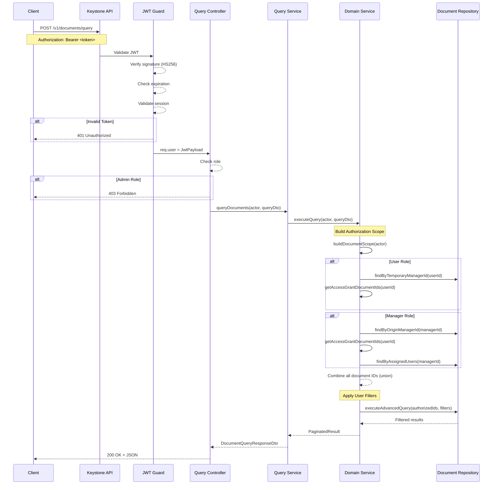
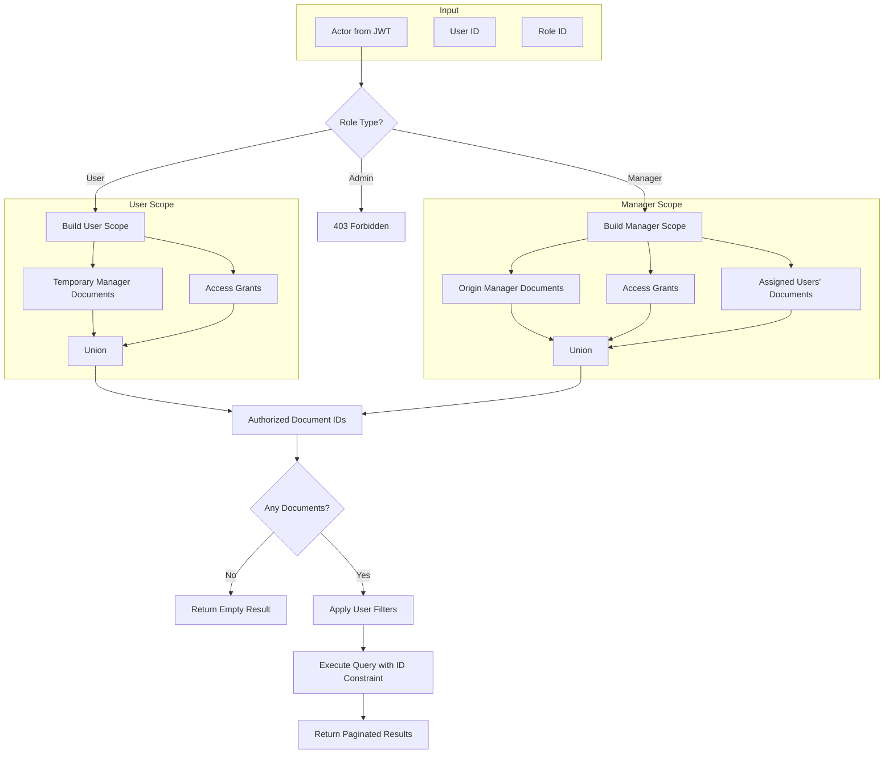
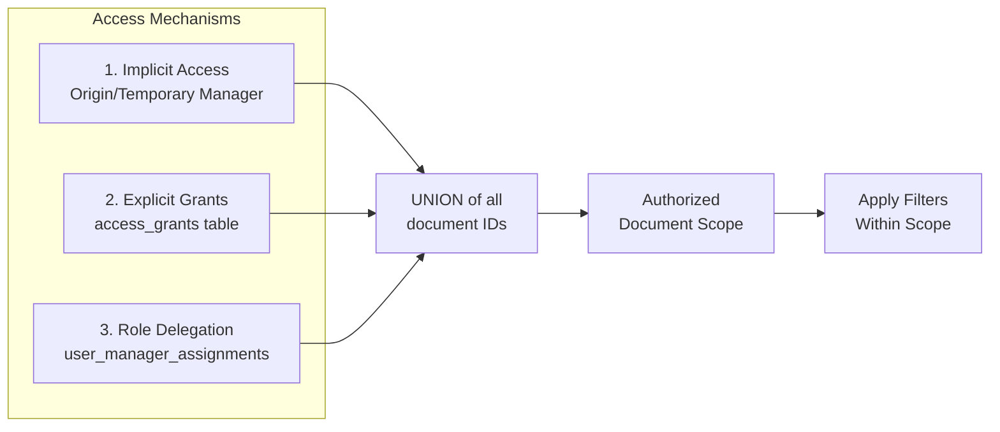
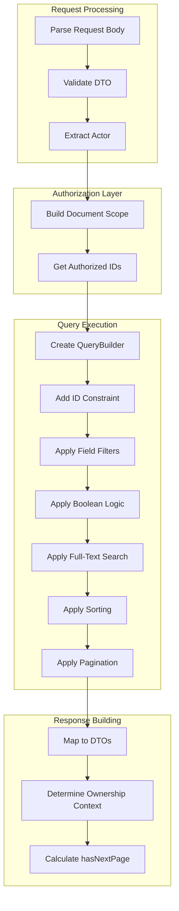

# Document Query API Guide

## Overview

The Document Query API (`POST /v1/documents/query`) provides a powerful, authorization-first query interface that allows users and managers to search their accessible documents using advanced filters, operators, and full-text search.

**Key Principle**: Authorization is enforced *before* any user-provided filters are applied. This ensures users can only ever see documents they're authorized to access, regardless of what filters they specify.

---

## Table of Contents

1. [Authentication](#authentication)
2. [Authorization Model](#authorization-model)
3. [Access Mechanisms](#access-mechanisms)
4. [Role Restrictions](#role-restrictions)
5. [Query Language](#query-language)
6. [Response Format](#response-format)
7. [Workflow Diagrams](#workflow-diagrams)
8. [Examples](#examples)

---

## Authentication

All requests to the document query endpoint require a valid JWT access token.

```http
POST /api/v1/documents/query
Authorization: Bearer <access_token>
Content-Type: application/json
```

### Token Requirements

- **Algorithm**: HS256 (delegated tokens)
- **Required Claims**:
  - `sub` or `id`: User ID
  - `role`: User's role object with `id` field
  - `exp`: Expiration timestamp
  - `sessionId`: Valid session identifier

### Error Responses

| Status | Description |
|--------|-------------|
| 401 | Invalid or expired access token |
| 403 | Forbidden (admin role) |

---

## Authorization Model

The document query system uses an **Authorization-First** approach:

```
┌─────────────────────────────────────────────────────────────┐
│                    Query Execution Flow                      │
├─────────────────────────────────────────────────────────────┤
│  1. Extract actor from JWT (userId + role)                  │
│  2. Build authorized document scope (IDs user can access)   │
│  3. Apply user-provided filters WITHIN that scope           │
│  4. Return paginated results with ownership context         │
└─────────────────────────────────────────────────────────────┘
```

This ensures:
- Users can **never** query documents outside their authorized scope
- Filters only reduce results, never expand access
- No SQL injection or filter manipulation can bypass authorization

---

## Access Mechanisms

The query endpoint supports three distinct access mechanisms that combine to form a user's document scope:

### 1. Implicit Access (Origin/Temporary Manager)

Documents where the user has inherent ownership based on upload context.

| Access Type | Condition | Description |
|------------|-----------|-------------|
| **Origin Manager** | `document.originManagerId = manager.id` | Manager who uploaded the document |
| **Temporary Manager** | `document.temporaryManagerId = user.id` | User who uploaded without an assigned manager |

### 2. Explicit Access Grants

Documents where the actor has been granted access via the `access_grants` table.

```sql
-- Access granted if:
SELECT * FROM access_grants 
WHERE subject_id = :userId 
  AND subject_type = 'user'
  AND status = 'active'
  AND (expires_at IS NULL OR expires_at > NOW())
```

Grant types:
- `owner`: Full access (can manage, grant to others)
- `delegated`: Read access granted by owner
- `derived`: Read access granted by delegate

### 3. Manager-User Assignments (Role Delegation)

Managers can access documents of users assigned to them via the `user_manager_assignments` table.

```sql
-- Manager can access assigned users' documents:
SELECT d.* FROM documents d
JOIN user_manager_assignments uma ON uma.user_id = d.temporary_manager_id
WHERE uma.manager_id = :managerUserId
  AND uma.deleted_at IS NULL
```

---

## Role Restrictions

### Role Hierarchy

```
┌─────────────────────────────────────────────────────────────┐
│                      Role Access Matrix                      │
├──────────┬──────────────────────────────────────────────────┤
│  Role    │  Document Query Access                           │
├──────────┼──────────────────────────────────────────────────┤
│  Admin   │  ❌ BLOCKED - Returns 403 Forbidden              │
│          │  Admins do not have document-level access        │
├──────────┼──────────────────────────────────────────────────┤
│  Manager │  ✅ Can query:                                   │
│          │  • Own documents (origin manager)                │
│          │  • Assigned users' documents                     │
│          │  • Documents with explicit grants                │
├──────────┼──────────────────────────────────────────────────┤
│  User    │  ✅ Can query:                                   │
│          │  • Own documents (temporary manager)             │
│          │  • Documents with explicit grants                │
└──────────┴──────────────────────────────────────────────────┘
```

### Admin Restriction Rationale (HIPAA)

Admins are explicitly blocked from document-level access to maintain:
- **Separation of Concerns**: System administration ≠ PHI access
- **HIPAA Compliance**: Minimum necessary access principle
- **Audit Trail**: Clear distinction between admin and clinical actions

---

## Query Language

### Request Structure

```typescript
interface DocumentQueryRequest {
  query?: FieldFilter | BooleanQuery;      // Filter conditions
  fullText?: string;                        // Full-text search
  pagination?: {
    page: number;                           // Page number (1-based)
    limit: number;                          // Items per page (max 100)
  };
  sort?: {
    field: string;                          // Field to sort by
    order: 'ASC' | 'DESC';                  // Sort direction
  };
}
```

### Field Filters

Filter documents by field values using operators:

```typescript
interface FieldFilter {
  field: string;              // Field name (e.g., 'status', 'documentType')
  op: QueryOperator;          // Operator
  value: string | number | string[] | [Date, Date];
}

type QueryOperator = 
  | 'eq'        // Equal
  | 'ne'        // Not equal
  | 'gt'        // Greater than
  | 'gte'       // Greater than or equal
  | 'lt'        // Less than
  | 'lte'       // Less than or equal
  | 'contains'  // String contains (case-insensitive)
  | 'startsWith'// String starts with
  | 'in'        // Value in array
  | 'between';  // Value between range [start, end]
```

### Boolean Combinators

Combine multiple filters with AND/OR logic:

```typescript
interface BooleanQuery {
  and?: (FieldFilter | BooleanQuery)[];    // All conditions must match
  or?: (FieldFilter | BooleanQuery)[];     // Any condition must match
}
```

### Extracted Field Filters

Query OCR-extracted fields:

```typescript
interface ExtractedFieldFilter {
  extractedField: {
    key: string;              // Field key (e.g., 'patientName', 'testResult')
    op: QueryOperator;        // Operator
    value: string | number;   // Value to match
  };
}
```

### Queryable Fields

| Field | Type | Description |
|-------|------|-------------|
| `status` | enum | Document processing status |
| `documentType` | enum | Type of document |
| `fileName` | string | Original file name |
| `description` | string | Document description |
| `uploadedAt` | datetime | Upload timestamp |
| `createdAt` | datetime | Creation timestamp |
| `updatedAt` | datetime | Last update timestamp |

---

## Response Format

### Success Response (200 OK)

```typescript
interface DocumentQueryResponse {
  data: DocumentQueryItem[];
  hasNextPage: boolean;
}

interface DocumentQueryItem {
  id: string;                              // Document UUID
  fileName: string;
  documentType: string;
  status: string;
  description?: string;
  uploadedAt: string;                      // ISO 8601
  createdAt: string;
  updatedAt: string;
  ownershipContext: 'own' | 'assigned_user' | 'granted';
}
```

### Ownership Context

The `ownershipContext` field indicates *why* the user can access this document:

| Value | Meaning |
|-------|---------|
| `own` | User is the origin/temporary manager (uploaded the document) |
| `assigned_user` | Manager querying a document from an assigned user |
| `granted` | Access via explicit AccessGrant |

---

## Workflow Diagrams

### Authentication & Authorization Flow



### Document Scope Building



### Access Mechanism Priority



### Query Processing Pipeline



---

## Examples

### Basic Query - Filter by Document Type

```json
POST /api/v1/documents/query
{
  "query": {
    "field": "documentType",
    "op": "eq",
    "value": "LAB_RESULT"
  },
  "pagination": {
    "page": 1,
    "limit": 20
  }
}
```

### Multi-Status Filter (IN Operator)

```json
{
  "query": {
    "field": "status",
    "op": "in",
    "value": ["STORED", "PROCESSED", "PROCESSING"]
  },
  "pagination": {
    "page": 1,
    "limit": 20
  }
}
```

### Combined Filters (AND)

```json
{
  "query": {
    "and": [
      {
        "field": "documentType",
        "op": "in",
        "value": ["LAB_RESULT", "PRESCRIPTION"]
      },
      {
        "field": "status",
        "op": "ne",
        "value": "FAILED"
      }
    ]
  },
  "pagination": {
    "page": 1,
    "limit": 20
  }
}
```

### Full-Text Search

```json
{
  "fullText": "blood test results",
  "pagination": {
    "page": 1,
    "limit": 20
  }
}
```

### Extracted Field Query (OCR Data)

```json
{
  "query": {
    "extractedField": {
      "key": "patientName",
      "op": "contains",
      "value": "Smith"
    }
  },
  "pagination": {
    "page": 1,
    "limit": 20
  }
}
```

### Date Range Query

```json
{
  "query": {
    "field": "uploadedAt",
    "op": "between",
    "value": ["2025-01-01T00:00:00Z", "2025-12-31T23:59:59Z"]
  },
  "pagination": {
    "page": 1,
    "limit": 20
  },
  "sort": {
    "field": "uploadedAt",
    "order": "DESC"
  }
}
```

### Complex Query (Nested Boolean)

```json
{
  "query": {
    "and": [
      {
        "field": "status",
        "op": "eq",
        "value": "PROCESSED"
      },
      {
        "or": [
          {
            "field": "documentType",
            "op": "eq",
            "value": "LAB_RESULT"
          },
          {
            "field": "documentType",
            "op": "eq",
            "value": "PRESCRIPTION"
          }
        ]
      }
    ]
  },
  "pagination": {
    "page": 1,
    "limit": 20
  }
}
```

### Example Response

```json
{
  "data": [
    {
      "id": "123e4567-e89b-12d3-a456-426614174000",
      "fileName": "lab-results-2025.pdf",
      "documentType": "LAB_RESULT",
      "status": "PROCESSED",
      "description": "Annual blood work",
      "uploadedAt": "2025-01-10T14:30:00.000Z",
      "createdAt": "2025-01-10T14:30:00.000Z",
      "updatedAt": "2025-01-10T14:35:00.000Z",
      "ownershipContext": "own"
    },
    {
      "id": "987fcdeb-51a2-3d4e-b678-901234567890",
      "fileName": "prescription-2025.pdf",
      "documentType": "PRESCRIPTION",
      "status": "PROCESSED",
      "description": null,
      "uploadedAt": "2025-01-08T09:15:00.000Z",
      "createdAt": "2025-01-08T09:15:00.000Z",
      "updatedAt": "2025-01-08T09:20:00.000Z",
      "ownershipContext": "assigned_user"
    }
  ],
  "hasNextPage": true
}
```

---

## Rate Limiting

The query endpoint is rate-limited to prevent abuse:

| Limit | Value |
|-------|-------|
| Requests per minute | 30 |
| Burst | 10 |

Exceeding the limit returns `429 Too Many Requests`.

---

## HIPAA Considerations

- **No PHI in JWT**: Tokens contain only `id`, `role`, `sessionId`
- **No PHI in Logs**: Only `userId`, `event`, `timestamp` logged
- **Audit Trail**: All queries are logged for compliance
- **Minimum Necessary**: Users only see documents they need
- **Admin Separation**: Admins cannot access document content

---

## Related Endpoints

| Endpoint | Description |
|----------|-------------|
| `GET /v1/documents/:id` | Get single document by ID |
| `GET /v1/documents` | List documents (legacy, uses query params) |
| `POST /v1/documents/upload` | Upload new document |
| `POST /v1/documents/:id/ocr/trigger` | Trigger OCR processing |
| `POST /v1/access-grants` | Create access grant |
