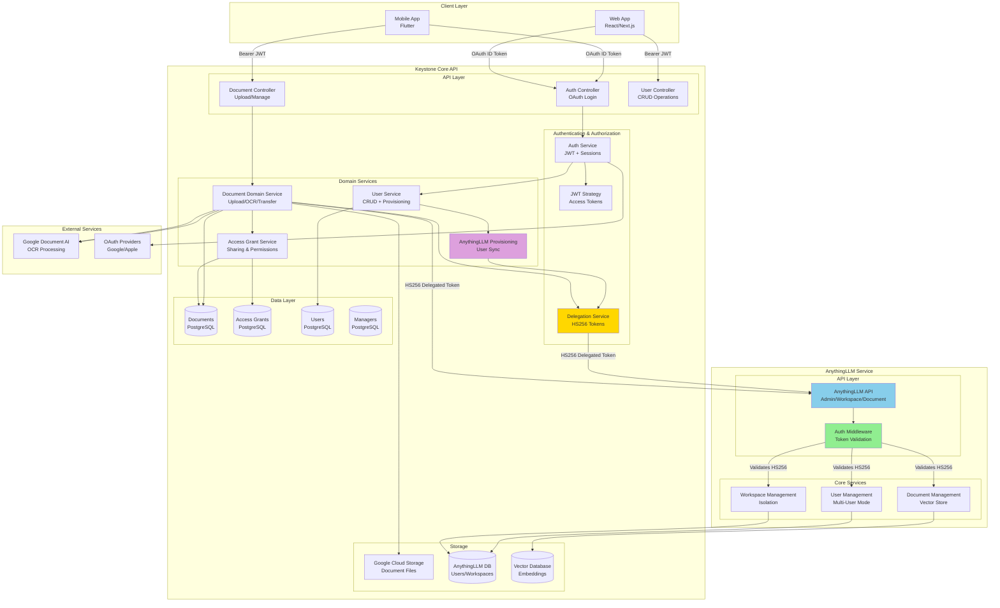
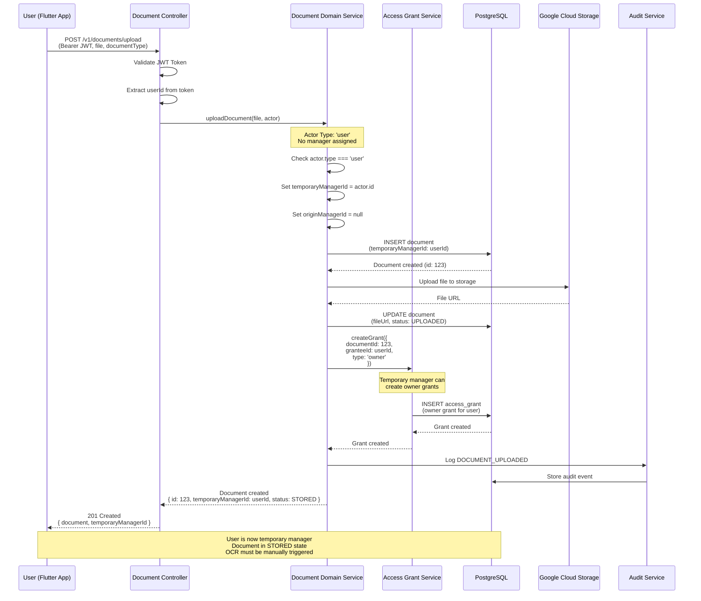
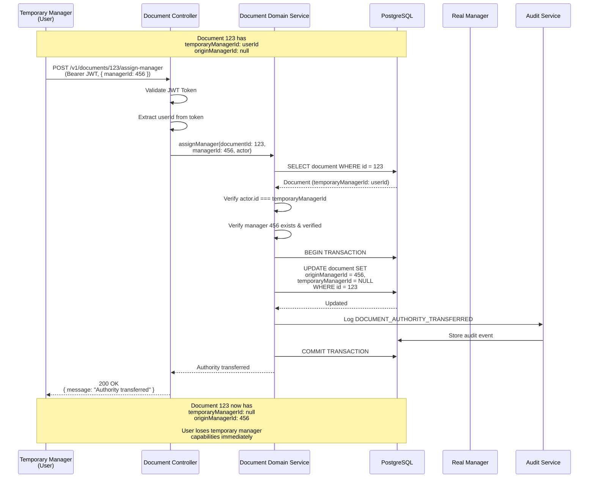
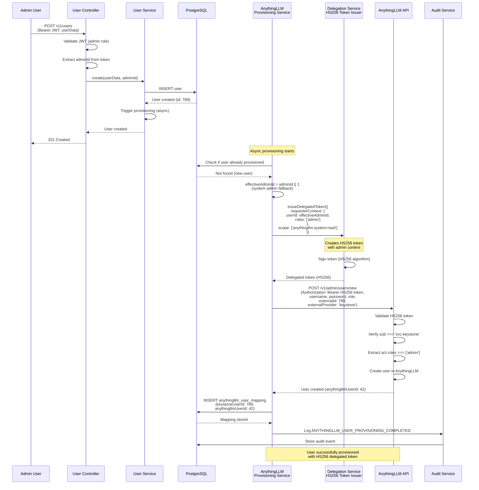
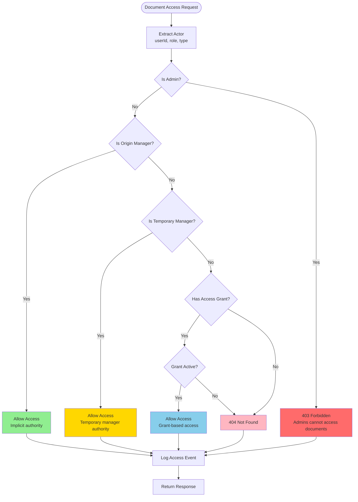
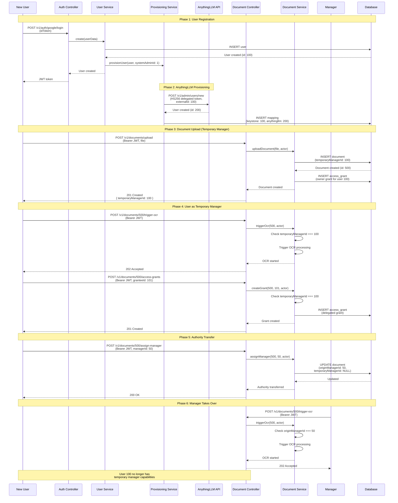

# Temporary Manager & AnythingLLM Integration Architecture

**Document Version**: 1.0  
**Generated**: January 2026  
**Classification**: Internal - System Architecture

---

## Table of Contents

- [Table of Contents](#table-of-contents)
- [System Architecture Overview](#system-architecture-overview)
- [Temporary Manager Upload Flow](#temporary-manager-upload-flow)
- [Manager Assignment \& Authority Transfer](#manager-assignment--authority-transfer)
- [AnythingLLM User Provisioning Flow](#anythingllm-user-provisioning-flow)
- [Token Delegation Architecture](#token-delegation-architecture)
- [Document Access Control Flow](#document-access-control-flow)
- [Complete End-to-End Workflow](#complete-end-to-end-workflow)
- [Key Architectural Decisions](#key-architectural-decisions)
  - [1. HS256 Delegated Tokens (Standardized)](#1-hs256-delegated-tokens-standardized)
  - [2. Manual OCR Trigger (Never Automatic)](#2-manual-ocr-trigger-never-automatic)
  - [3. Temporary Manager Authority](#3-temporary-manager-authority)
  - [4. Atomic Authority Transfer](#4-atomic-authority-transfer)
  - [5. Asynchronous Provisioning](#5-asynchronous-provisioning)
- [Security Considerations](#security-considerations)
  - [Token Security](#token-security)
  - [Access Control](#access-control)
  - [Audit \& Compliance](#audit--compliance)
- [Configuration Requirements](#configuration-requirements)
  - [Environment Variables](#environment-variables)
  - [Database Constraints](#database-constraints)
- [Future Enhancements](#future-enhancements)
- [References](#references)

---

## System Architecture Overview

This diagram shows the complete system architecture including Keystone Core API, AnythingLLM, and all integration points.



**Key Components:**

- **Keystone Core API**: Main application handling authentication, document management, and user provisioning
- **AnythingLLM**: External service for document processing, vector search, and AI capabilities
- **Delegation Service**: Issues HS256 delegated tokens for service-to-service communication
- **Provisioning Service**: Automatically syncs users to AnythingLLM when created in Keystone

---

## Temporary Manager Upload Flow

This sequence diagram shows how a user uploads a document and becomes a temporary manager.



**Key Points:**

1. **User uploads without manager**: No `originManagerId` required
2. **Temporary manager assignment**: `temporaryManagerId` is set to user's ID
3. **Manual OCR**: OCR must be manually triggered via trigger endpoint (avoids overhead)
4. **Full authority**: User gets all origin manager capabilities (OCR, sharing, editing)
5. **Owner grant**: Automatic owner grant created for the uploading user
6. **Domain architecture**: Processing follows domain-driven design, maintaining role-based access control

---

## Manager Assignment & Authority Transfer

This flow shows how authority is transferred from a temporary manager to a real manager.



**Key Points:**

1. **Only temporary manager can transfer**: Must be the current temporary manager
2. **Atomic transfer**: Database transaction ensures consistency
3. **Immediate effect**: User loses temporary manager capabilities after transfer
4. **Audit trail**: Authority transfer is logged for compliance

---

## AnythingLLM User Provisioning Flow

This diagram shows how users are automatically provisioned to AnythingLLM when created in Keystone, using HS256 delegated tokens.



**Key Points:**

1. **Automatic provisioning**: Triggered asynchronously on user creation
2. **HS256 delegated tokens**: Always used (no RS256 fallback)
3. **Admin context**: Uses provided adminId or system admin (ID: 1) as fallback
4. **Idempotent**: Checks for existing user before creating
5. **Mapping stored**: Keystone user ID mapped to AnythingLLM user ID

---

## Token Delegation Architecture

This diagram shows how HS256 delegated tokens are created and used for service-to-service communication.

```mermaid
graph TB
    subgraph "Keystone Core API"
        UserRequest[User Request<br/>Bearer JWT]
        ExtractContext[Extract User Context<br/>userId, roles, sessionId]
        DelegationService[Delegation Service<br/>Token Issuer]
        JwtSigner[JWT Signer<br/>HS256 Algorithm]
        Keystore[Keystore<br/>Shared Secret]
    end

    subgraph "Token Structure"
        TokenHeader[Token Header<br/>alg: HS256<br/>typ: JWT]
        TokenPayload[Token Payload<br/>sub: 'svc-keystone'<br/>act: { userId, roles }<br/>aud: 'anythingllm'<br/>exp: timestamp]
        TokenSignature[Token Signature<br/>HMAC SHA-256]
    end

    subgraph "AnythingLLM Service"
        ReceiveToken[Receive Request<br/>Authorization Header]
        ValidateToken[Validate Token<br/>HS256 + Secret]
        ExtractActor[Extract Actor Context<br/>act.userId, act.roles]
        Authorize[Authorize Operation<br/>Based on act.roles]
    end

    UserRequest --> ExtractContext
    ExtractContext --> DelegationService
    DelegationService --> Keystore
    Keystore -->|Shared Secret| JwtSigner
    DelegationService --> JwtSigner
    
    JwtSigner --> TokenHeader
    JwtSigner --> TokenPayload
    JwtSigner --> TokenSignature
    
    TokenHeader --> ReceiveToken
    TokenPayload --> ReceiveToken
    TokenSignature --> ReceiveToken
    
    ReceiveToken --> ValidateToken
    ValidateToken -->|Valid| ExtractActor
    ExtractActor --> Authorize
    
    style DelegationService fill:#FFD700
    style JwtSigner fill:#90EE90
    style ValidateToken fill:#87CEEB
    style TokenPayload fill:#DDA0DD
```

**Token Payload Example:**

```json
{
  "sub": "svc-keystone",
  "act": {
    "sub": "123",
    "roles": ["admin"],
    "sessionId": "session-abc"
  },
  "aud": "anythingllm",
  "iat": 1704067200,
  "exp": 1704067500,
  "nbf": 1704067140
}
```

**Key Points:**

1. **HS256 algorithm**: Always used for delegated tokens (symmetric key)
2. **Service identity**: `sub: 'svc-keystone'` identifies token issuer
3. **Actor claim**: `act` claim embeds user context (RFC 8693)
4. **Shared secret**: Both services must have same secret
5. **Short-lived**: Tokens expire in 5 minutes (configurable)

---

## Document Access Control Flow

This diagram shows how document access is resolved for different actor types, including temporary managers.



**Access Resolution Rules:**

1. **Admins**: Hard-denied (no document access)
2. **Origin Manager**: Implicit access (no grant needed)
3. **Temporary Manager**: Implicit access (if `temporaryManagerId === actor.id`)
4. **Access Grants**: Explicit access via grants (owner, delegated, derived)
5. **No Access**: Returns 404 (not 403) to prevent information leakage

---

## Complete End-to-End Workflow

This comprehensive workflow shows a complete scenario: user registration → document upload → AnythingLLM provisioning → authority transfer.



**Workflow Summary:**

1. **User Registration**: User signs in via Google OAuth, account created in Keystone
2. **Automatic Provisioning**: User automatically provisioned to AnythingLLM with HS256 token
3. **Document Upload**: User uploads document, becomes temporary manager
4. **Temporary Manager Operations**: User can trigger OCR, create access grants, edit metadata
5. **Authority Transfer**: User assigns real manager, loses temporary manager capabilities
6. **Manager Operations**: Real manager takes over with full origin manager authority

---

## Key Architectural Decisions

### 1. HS256 Delegated Tokens (Standardized)

**Decision**: Always use HS256 delegated tokens for AnythingLLM communication, never RS256 service identity.

**Rationale**:
- Consistent authentication method across all operations
- AnythingLLM expects HS256 algorithm
- Delegated tokens embed user context (RFC 8693)
- Simpler key management (shared secret vs. RSA key pairs)

**Implementation**:
- System admin ID (1) used as fallback when no admin context available
- All provisioning operations use orchestrator with delegated tokens
- No RS256 fallback paths

### 2. Manual OCR Trigger (Never Automatic)

**Decision**: OCR processing is always manual and must be explicitly triggered via the trigger endpoint. OCR is never automatic.

**Rationale**:
- Avoids overhead of automatic processing
- Gives users control over when processing happens
- Maintains domain architecture (processing handled by domain service)
- Role-based access control is maintained (only origin manager or temporary manager can trigger)

**Implementation**:
- `uploadDocument()` stores document in STORED state (ready for processing)
- OCR must be manually triggered via `POST /v1/documents/:documentId/ocr/trigger`
- Only origin manager or temporary manager can trigger OCR
- Domain service maintains control over processing flow

### 3. Temporary Manager Authority

**Decision**: Temporary managers have identical capabilities to origin managers.

**Rationale**:
- Enables flexible document intake workflow
- Users can manage documents before manager assignment
- Consistent access control model
- Authority can be transferred when needed

**Implementation**:
- `temporaryManagerId` column in documents table
- Check constraint ensures exclusive OR (origin OR temporary, never both)
- Access control checks both `originManagerId` and `temporaryManagerId`

### 4. Atomic Authority Transfer

**Decision**: Authority transfer is atomic and immediate.

**Rationale**:
- Prevents race conditions
- Clear ownership model
- Audit trail for compliance
- No intermediate states

**Implementation**:
- Database transaction ensures atomicity
- Immediate capability loss for temporary manager
- Audit event logged for transfer

### 5. Asynchronous Provisioning

**Decision**: AnythingLLM provisioning is fire-and-forget, non-blocking.

**Rationale**:
- User creation should not be delayed by external service
- Provisioning failures don't block user registration
- Retry logic can handle transient failures
- Better user experience

**Implementation**:
- Async provisioning trigger in `UsersService.create()`
- Errors logged but don't fail user creation
- Idempotent provisioning (checks for existing user)

---

## Security Considerations

### Token Security

- **HS256 Algorithm**: Symmetric key algorithm, requires shared secret
- **Short Expiration**: Delegated tokens expire in 5 minutes
- **Not Before Claim**: 60-second clock skew allowance
- **Audience Validation**: Tokens validated against `anythingllm` audience
- **Service Identity**: `sub: 'svc-keystone'` identifies token issuer

### Access Control

- **Temporary Manager Validation**: Only current temporary manager can transfer authority
- **Manager Verification**: Only verified managers can be assigned
- **Admin Exclusion**: Admins cannot access documents (HIPAA compliance)
- **404 on Denial**: Returns 404 (not 403) to prevent information leakage

### Audit & Compliance

- **All Operations Logged**: Document uploads, authority transfers, provisioning
- **No PHI in Logs**: Only user IDs, no emails or names
- **Structured Logging**: JSON format for easy parsing
- **HIPAA Compliant**: Audit trail for compliance requirements

---

## Configuration Requirements

### Environment Variables

**Keystone Core API:**
```bash
# Delegated Token Configuration
ENABLE_DELEGATED_TOKENS=true
ANYTHINGLLM_DELEGATED_TOKEN_SECRET=<shared-secret>
ANYTHINGLLM_DELEGATED_TOKEN_EXPIRES_IN=300
ANYTHINGLLM_DELEGATED_TOKEN_AUDIENCE=anythingllm
AUTH_JWT_ISSUER=https://keystone.example.com

# AnythingLLM Integration
ANYTHINGLLM_BASE_URL=http://localhost:3001/api
ANYTHINGLLM_SERVICE_AUTH_MODE=delegated
```

**AnythingLLM:**
```bash
# Delegated Token Validation
KEYSTONE_DELEGATED_TOKEN_SECRET=<same-secret-as-keystone>
KEYSTONE_AUDIENCE=anythingllm
KEYSTONE_ISSUER=https://keystone.example.com
```

### Database Constraints

```sql
-- Check constraint ensures exclusive OR
ALTER TABLE documents
ADD CONSTRAINT CHK_documents_origin_exclusive
CHECK (
  (origin_manager_id IS NOT NULL AND temporary_manager_id IS NULL) OR
  (origin_manager_id IS NULL AND temporary_manager_id IS NOT NULL)
);
```

---

## Future Enhancements

1. **Workspace Assignment**: Automatic workspace creation for temporary managers
2. **Bulk Authority Transfer**: Transfer multiple documents at once
3. **Temporary Manager Expiration**: Auto-transfer after time period
4. **RS256 Migration**: Future migration to RS256 for enhanced security
5. **GCP Secret Manager**: Move secrets from env vars to Secret Manager

---

## References

- [Temporary Manager Feature Documentation](../features/temporary-manager-support.md)
- [AnythingLLM Delegated Token Authentication](../anythingllm-delegated-token-authentication.md)
- [AnythingLLM Authentication Setup](../anythingllm/authentication/setup.md)
- [System Architecture Diagrams](../reports/system-architecture-diagrams.md)

