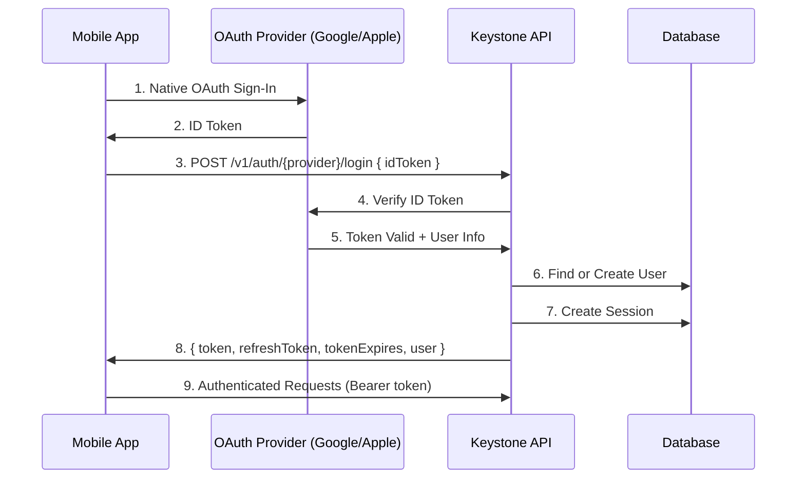

# HIPAA-Compliant Authentication Architecture

## Table of Contents

- [Overview](#overview)
- [Architecture](#architecture)
- [HIPAA Compliance](#hipaa-compliance)
- [Security Controls](#security-controls)
- [OAuth Implementation](#oauth-implementation)
- [API Endpoints Reference](#api-endpoints-reference)
  - [Logout](#logout)
  - [Get Current User Profile](#get-current-user-profile)
  - [Token Refresh](#token-refresh)
- [Session Management](#session-management)
- [Audit Logging](#audit-logging)
- [Rate Limiting](#rate-limiting)
- [Production Hardening](#production-hardening)
- [Environment Variables](#environment-variables)
- [Monitoring & Alerts](#monitoring--alerts)
- [Incident Response](#incident-response)
- [Testing](#testing)
- [FAQ](#faq)

---

## Overview

Keystone Core API implements a **mobile-first OAuth authentication flow** designed for HIPAA compliance. This architecture ensures:

- ✅ **No PHI in OAuth flows** - Only identity information (no health data)
- ✅ **Encrypted data in transit** - HTTPS enforced in production
- ✅ **Audit logging** - All auth events logged for HIPAA compliance
- ✅ **Session-based authentication** - Stateful sessions with refresh token rotation
- ✅ **Rate limiting** - Protection against brute force attacks
- ✅ **Secure secret management** - Ready for GCP Secret Manager

---

## Architecture

### Mobile-First OAuth Flow

**IMPORTANT**: We do NOT use redirect-based OAuth. This is intentional.

#### Flow Diagram



### Why Mobile-First?

1. **Better UX** - Native OS authentication flows
2. **More Secure** - No redirect vulnerabilities
3. **HIPAA-Aligned** - Client controls OAuth scopes
4. **Simpler Backend** - Token verification only

---

## HIPAA Compliance

### Core Principles

#### 1. NO PHI in Authentication

```
✅ ALLOWED in Auth:
- User ID
- Email address
- First/Last name
- OAuth provider
- OAuth subject ID (sub)
- Role (RBAC)

❌ FORBIDDEN in Auth:
- Health records
- Medical history
- Lab results
- Diagnoses
- Prescriptions
- ANY clinical data
```

#### 2. JWT Payload (Minimalist)

```typescript
// Access Token Payload
{
  "id": "user-123",
  "role": { "id": 2 },
  "sessionId": "session-456",
  "iat": 1234567890,
  "exp": 1234568790
}

// ❌ DO NOT ADD:
// - email
// - name
// - any health data
```

#### 3. Audit Logging

Every authentication event is logged:

```json
{
  "timestamp": "2025-10-25T12:34:56.789Z",
  "service": "keystone-core-api",
  "component": "auth",
  "userId": "user-123",
  "provider": "google",
  "event": "LOGIN_SUCCESS",
  "sessionId": "session-456",
  "success": true,
  "environment": "production"
}
```

**NEVER LOGGED:**
- Raw tokens
- Refresh tokens
- Passwords
- ID tokens from providers
- Email addresses in failed login attempts

---

## Security Controls

### 1. Rate Limiting

Protects against brute force attacks:

| Endpoint | Limit | Window |
|----------|-------|--------|
| POST /v1/auth/email/login | 5 req | 60s |
| POST /v1/auth/google/login | 5 req | 60s |
| POST /v1/auth/apple/login | 5 req | 60s |
| POST /v1/auth/email/register | 5 req | 60s |
| POST /v1/auth/forgot/password | 3 req | 60s |
| POST /v1/auth/refresh | 10 req | 60s |

**Configuration:**

```env
THROTTLE_TTL=60000  # milliseconds
THROTTLE_LIMIT=10   # global default
THROTTLE_AUTH_TTL=60000
THROTTLE_AUTH_LIMIT=5
```

### 2. HTTPS Enforcement

**Production:**
- All requests MUST use HTTPS
- HTTP requests return `403 Forbidden`
- HSTS headers enforce HTTPS for 1 year

**Development:**
- HTTP allowed for local testing
- Warnings logged

### 3. Security Headers (Helmet)

Automatically added to all responses:

```
Strict-Transport-Security: max-age=31536000; includeSubDomains; preload
X-Frame-Options: DENY
X-Content-Type-Options: nosniff
X-XSS-Protection: 1; mode=block
Content-Security-Policy: default-src 'self'
```

---

## OAuth Implementation

### Google Sign-In

**Endpoint:** `POST /v1/auth/google/login`

**Request:**
```json
{
  "idToken": "eyJhbGciOiJSUzI1NiIsImtpZCI..."
}
```

**Response:**
```json
{
  "token": "eyJhbGciOiJIUzI1NiIsInR5cCI...",
  "refreshToken": "eyJhbGciOiJIUzI1NiIsInR5cCI...",
  "tokenExpires": 1730000000000,
  "user": {
    "id": "user-123",
    "firstName": "John",
    "lastName": "Doe",
    "role": { "id": 2, "name": "user" },
    "status": { "id": 1, "name": "active" }
  }
}
```

**Server-Side Flow:**
1. Receive ID token from Flutter
2. Verify using `google-auth-library`
3. Extract `sub`, `email`, `given_name`, `family_name`
4. Find user by `socialId` + `provider` OR by `email`
5. Create new user if not found
6. Create session
7. Issue JWT + refresh token
8. Log audit event
9. Return tokens + user

**Configuration:**
```env
GOOGLE_CLIENT_ID=your-client-id.apps.googleusercontent.com
GOOGLE_CLIENT_SECRET=your-client-secret  # TODO: Move to GCP Secret Manager
```

### Apple Sign In

**Endpoint:** `POST /v1/auth/apple/login`

**Request:**
```json
{
  "idToken": "eyJraWQiOiJlWGF1bm1LNFQ...",
  "firstName": "Jane",  // Optional, only on first sign-in
  "lastName": "Smith"   // Optional, only on first sign-in
}
```

**Apple Specifics:**
- First/Last name only provided on FIRST sign-in
- Email may be Apple relay (e.g., `xyz@privaterelay.appleid.com`)
- Email may be null if user doesn't share
- `sub` from token is the stable identifier

**Configuration:**
```env
APPLE_APP_AUDIENCE=["com.healthatlas.app", "com.healthatlas.web"]
```

### Apple Server-to-Server Notifications

**Endpoint:** `POST /v1/auth/apple/notifications`

**Purpose:** Receives notifications from Apple about user account changes.

**Configuration Required:**
1. Log in to [Apple Developer Console](https://developer.apple.com/account/resources/identifiers/list)
2. Select your App ID
3. Enable "Sign in with Apple" → Configure
4. Set Server-to-Server Notification Endpoint:
   ```
   https://your-domain.com/api/v1/auth/apple/notifications
   ```
5. Requirements:
   - Must be absolute URL (scheme + host + path)
   - Must support TLS 1.2 or higher
   - Must be publicly accessible (Apple POSTs here)
   - Must return `200 OK` to acknowledge

**Events Received:**

| Event Type | Description | Action Taken |
|------------|-------------|--------------|
| `email-disabled` | User stopped using Hide My Email | Logged for audit |
| `email-enabled` | User started using Hide My Email | Email updated, logged |
| `consent-revoked` | User stopped using Sign in with Apple | **All sessions invalidated** |
| `account-delete` | User deleted their Apple account | **Account soft-deleted, sessions invalidated** |

**Request Format:**
```json
{
  "payload": "eyJhbGciOiJSUzI1NiIsImtpZCI6IldYRzg..."
}
```

The `payload` is a JWS (JSON Web Signature) signed by Apple.

**Server-Side Flow:**
1. Receive JWS-signed notification from Apple
2. Verify JWS signature using Apple's public keys
3. Decode and parse event data
4. Find user by `sub` (Apple socialId)
5. Handle event based on type:
   - **email-disabled/enabled:** Log event, optionally update email
   - **consent-revoked:** Invalidate all user sessions immediately
   - **account-delete:** Soft-delete user, invalidate all sessions
6. Log audit event (HIPAA compliance)
7. Return `200 OK` to Apple

**HIPAA Compliance:**
- ✅ **No PHI processed** - Only identity events
- ✅ **All events logged** for audit trail
- ✅ **Sessions invalidated** immediately on consent revocation
- ✅ **Soft delete only** - Maintains audit records
- ✅ **JWS signature verified** - Ensures authenticity

**Security Notes:**
- No rate limiting on this endpoint (Apple is trusted caller)
- JWS signature MUST be verified before processing
- Malformed payloads rejected with `401 Unauthorized`
- Raw JWS payload NEVER logged (contains user data)
- Only event type and user ID logged

**Example Notification Events:**

```typescript
// consent-revoked event
{
  "type": "consent-revoked",
  "sub": "001234.5678abcd...",
  "event_time": 1698765432
}
// → All user sessions invalidated immediately
// → User must re-authenticate to use the app

// account-delete event
{
  "type": "account-delete",
  "sub": "001234.5678abcd...",
  "event_time": 1698765432
}
// → User soft-deleted (deletedAt timestamp set)
// → All sessions invalidated
// → User record retained for HIPAA audit compliance
```

**Testing:**

To test this endpoint locally (without Apple):

```bash
# This will fail signature verification, but tests the endpoint structure
curl -X POST http://localhost:3000/api/v1/auth/apple/notifications \
  -H "Content-Type: application/json" \
  -d '{"payload": "test-jws-token"}'
# Expected: 401 Unauthorized (signature invalid)
```

For production testing, use Apple's testing tools or wait for real user events.

---

## API Endpoints Reference

### Logout

**Endpoint:** `POST /v1/auth/logout`

**Authentication:** Requires Bearer access token

**Request:**
```bash
curl -X POST https://api.healthatlas.com/api/v1/auth/logout \
  -H "Authorization: Bearer ACCESS_TOKEN_HERE"
```

**Response:**
```
204 No Content
```

**Server-Side Flow:**
1. Extract `sessionId` from JWT access token
2. Soft-delete session from database (set `deletedAt`)
3. Log `LOGOUT` audit event
4. All future requests with this access token → `401 Unauthorized`
5. Refresh token becomes invalid (tied to deleted session)

**Security Notes:**
- ✅ **Session immediately invalidated** in database
- ✅ **Access token becomes invalid** (session validated on every request)
- ✅ **Refresh token becomes invalid** (session not found)
- ✅ **Audit logging** for security monitoring
- ✅ **HIPAA-compliant** logout mechanism

**Critical Fix (Oct 31, 2025):** Logout now properly invalidates access tokens immediately. Previously, tokens would continue working until expiry even after logout (security vulnerability - now resolved).

### Get Current User Profile

**Endpoint:** `GET /v1/auth/me`

**Authentication:** Requires Bearer access token

**Request:**
```bash
curl https://api.healthatlas.com/api/v1/auth/me \
  -H "Authorization: Bearer ACCESS_TOKEN_HERE"
```

**Response:**
```json
{
  "id": "user-123",
  "email": "user@example.com",
  "firstName": "John",
  "lastName": "Doe",
  "provider": "google",
  "role": {
    "id": 2,
    "name": "user"
  },
  "status": {
    "id": 1,
    "name": "active"
  },
  "createdAt": "2025-01-15T10:30:00.000Z",
  "updatedAt": "2025-01-15T10:30:00.000Z"
}
```

**Security Notes:**
- ✅ No password or session hash exposed
- ✅ Only returns sanitized user data
- ✅ Respects class-transformer groups

### Token Refresh

**Endpoint:** `POST /v1/auth/refresh`

**Authentication:** Requires Bearer refresh token

**Request:**
```bash
curl -X POST https://api.healthatlas.com/api/v1/auth/refresh \
  -H "Authorization: Bearer REFRESH_TOKEN_HERE"
```

**Response:**
```json
{
  "token": "NEW_ACCESS_TOKEN",
  "refreshToken": "NEW_REFRESH_TOKEN",
  "tokenExpires": 1730000000000
}
```

**Server-Side Flow:**
1. Validate refresh token signature
2. Check session exists and hash matches
3. Generate new random session hash
4. Update session in database
5. Issue new access token + new refresh token
6. Old refresh token becomes invalid (hash rotation)
7. Log `REFRESH_TOKEN_SUCCESS` audit event

**Security Notes:**
- ✅ **Refresh token rotation** (prevents replay attacks)
- ✅ **Session hash updated** on each refresh
- ✅ **Old refresh token cannot be reused**
- ✅ **Session validation** before issuing new tokens

---

## Session Management

### Session Model

```typescript
{
  id: string | number,
  user: User,
  hash: string,  // Random hash, rotated on refresh
  createdAt: Date,
  updatedAt: Date,
  deletedAt: Date | null
}
```

### Token Lifecycle

```
1. Login
   ↓
   Create session with random hash
   ↓
   Issue access token (15m) + refresh token (10 years)
   
2. Protected Request (e.g., GET /v1/auth/me)
   ↓
   Validate JWT signature & expiry
   ↓
   Check session exists in database ✅ CRITICAL
   ↓
   If session deleted → 401 Unauthorized
   ↓
   If session valid → Allow request
   
3. Access token expires
   ↓
   POST /v1/auth/refresh with refresh token
   ↓
   Validate session exists and hash matches
   ↓
   Rotate hash (prevents replay attacks)
   ↓
   Issue new access token + new refresh token
   
4. Logout
   ↓
   Soft-delete session (set deletedAt)
   ↓
   All future requests → 401 Unauthorized ✅ IMMEDIATE
   ↓
   Refresh token also invalid (session not found)
```

### Refresh Token Rotation

**Why?**
- Prevents token replay attacks
- Limits damage from stolen refresh tokens
- HIPAA best practice

**How?**
- Each refresh creates new hash
- Old refresh token becomes invalid
- Client must use new refresh token

### Session Cleanup

**Automated Cleanup:**
- Runs daily at 2 AM UTC
- Deletes sessions older than 90 days
- Logs cleanup operations

**Configuration:**
```env
SESSION_RETENTION_DAYS=90  # TODO: Implement
SESSION_CLEANUP_ENABLED=true  # TODO: Implement
```

---

## Audit Logging

### Events Logged

| Event | When | userId | sessionId |
|-------|------|--------|-----------|
| `LOGIN_SUCCESS` | Successful login | ✅ | ✅ |
| `LOGIN_FAILED` | Failed login | ✅/unknown | ❌ |
| `ACCOUNT_CREATED` | New user via OAuth | ✅ | ✅ |
| `REFRESH_TOKEN_SUCCESS` | Token refreshed | ✅ | ✅ |
| `REFRESH_TOKEN_FAILED` | Refresh failed | ✅/unknown | ✅ |
| `LOGOUT` | User logged out | ✅ | ✅ |
| `INVALID_SESSION` | Token used after logout | ✅ | ✅ |
| `TOKEN_VALIDATION_FAILED` | Invalid token attempt | ✅/unknown | ❌ |
| `PASSWORD_RESET_REQUESTED` | Forgot password | ✅ | ❌ |
| `PASSWORD_RESET_COMPLETED` | Password changed | ✅ | ❌ |
| `EMAIL_CONFIRMED` | Email verified | ✅ | ❌ |
| `SESSION_EXPIRED` | Session cleaned up | ✅ | ✅ |
| `APPLE_EMAIL_DISABLED` | User disabled Hide My Email | ✅ | ❌ |
| `APPLE_EMAIL_ENABLED` | User enabled Hide My Email | ✅ | ❌ |
| `APPLE_CONSENT_REVOKED` | User revoked Apple Sign In | ✅ | ❌ |
| `APPLE_ACCOUNT_DELETED` | User deleted Apple account | ✅ | ❌ |

### Log Format

```json
{
  "timestamp": "2025-10-25T12:34:56.789Z",
  "service": "keystone-core-api",
  "component": "auth",
  "userId": "user-123",
  "provider": "google",
  "event": "LOGIN_SUCCESS",
  "sessionId": "session-456",
  "success": true,
  "ipAddress": "192.168.1.1",  // For security monitoring
  "userAgent": "HealthAtlas/1.0.0",
  "environment": "production"
}
```

### Future: GCP Cloud Logging

**TODO:**
```typescript
// Forward logs to GCP Cloud Logging
import { Logging } from '@google-cloud/logging';

const logging = new Logging();
const log = logging.log('auth-audit');

await log.write(log.entry({
  resource: { type: 'cloud_run_revision' },
  severity: 'INFO',
  jsonPayload: auditEntry
}));
```

**Retention:**
- HIPAA requires 6+ years
- Configure in GCP Console: Logging → Log Router → Sink

---

## Rate Limiting

### Implementation

Uses `@nestjs/throttler` with in-memory storage (default).

**Production TODO:**
- Use Redis for distributed rate limiting
- Share limits across multiple instances

### Configuration

**Global Defaults:**
```typescript
// app.module.ts
ThrottlerModule.forRoot({
  ttl: 60000,  // 60 seconds
  limit: 10    // 10 requests
})
```

**Per-Endpoint Override:**
```typescript
@Throttle({ default: { limit: 5, ttl: 60000 } })
@Post('email/login')
async login() { ... }
```

### Bypassing (Admin Tools)

```typescript
// Skip throttling for specific routes
@SkipThrottle()
@Get('health')
async healthCheck() { ... }
```

---

## Production Hardening

### 1. GCP Secret Manager

**Current State:** Secrets in environment variables

**Production TODO:**

```bash
# Create secrets
gcloud secrets create AUTH_JWT_SECRET --data-file=- <<< "your-secret-here"
gcloud secrets create AUTH_REFRESH_SECRET --data-file=- <<< "your-secret-here"
gcloud secrets create GOOGLE_CLIENT_SECRET --data-file=- <<< "your-secret-here"

# Grant access to service account
gcloud secrets add-iam-policy-binding AUTH_JWT_SECRET \
  --member="serviceAccount:keystone-api@project.iam.gserviceaccount.com" \
  --role="roles/secretmanager.secretAccessor"
```

**Code Integration:**

See `src/config/secret-manager.ts` for implementation stub.

**Benefits:**
- Centralized secret management
- Audit trail (who accessed what when)
- Automatic rotation support
- IAM-based access control

### 2. HTTPS at Load Balancer

**GCP Cloud Run:**
- HTTPS automatic
- Set `X-Forwarded-Proto` header

**GCP Cloud Load Balancing:**
```yaml
# Configure backend service
backends:
  - group: instance-group
    balancingMode: UTILIZATION
    maxUtilization: 0.8
    
# SSL Certificate
sslCertificates:
  - name: keystone-api-cert
    managed:
      domains:
        - api.healthatlas.com
```

### 3. Database Encryption

**PostgreSQL (Cloud SQL):**
- Encryption at rest (automatic)
- Encryption in transit (SSL/TLS)

**Connection String:**
```env
DATABASE_SSL_ENABLED=true
DATABASE_CA=/path/to/server-ca.pem
DATABASE_KEY=/path/to/client-key.pem
DATABASE_CERT=/path/to/client-cert.pem
```

### 4. Monitoring & Alerting

**GCP Cloud Monitoring Alerts:**

1. **High Login Failure Rate**
   - Condition: `login_failed` events > 100/min
   - Action: Alert security team

2. **Rate Limit Violations**
   - Condition: `429 Too Many Requests` > 1000/min
   - Action: Potential DDoS

3. **Session Cleanup Failures**
   - Condition: Cron job fails
   - Action: Alert DevOps

4. **Token Refresh Anomalies**
   - Condition: Refresh failures > 10%
   - Action: Investigate

### 5. Backup & Disaster Recovery

**Database Backups:**
- Automated daily backups (GCP Cloud SQL)
- Point-in-time recovery (7 days)
- Cross-region replication for HA

**Session Data:**
- Ephemeral, can be recreated
- Users re-login if sessions lost

---

## Environment Variables

### Required for Production

```env
# Node Environment
NODE_ENV=production

# Application
APP_PORT=8080
APP_NAME="Keystone Core API"
API_PREFIX=api
FRONTEND_DOMAIN=https://app.healthatlas.com
BACKEND_DOMAIN=https://api.healthatlas.com

# Database (Cloud SQL)
DATABASE_TYPE=postgres
DATABASE_HOST=/cloudsql/project:region:instance  # Unix socket
DATABASE_PORT=5432
DATABASE_USERNAME=keystone-api
DATABASE_PASSWORD=<SECRET_MANAGER>  # TODO: Move to Secret Manager
DATABASE_NAME=keystone_prod
DATABASE_SSL_ENABLED=true
DATABASE_MAX_CONNECTIONS=100

# Auth Secrets (TODO: Move to Secret Manager)
AUTH_JWT_SECRET=<SECRET_MANAGER>
AUTH_JWT_TOKEN_EXPIRES_IN=15m
AUTH_REFRESH_SECRET=<SECRET_MANAGER>
AUTH_REFRESH_TOKEN_EXPIRES_IN=3650d  # 10 years
AUTH_FORGOT_SECRET=<SECRET_MANAGER>
AUTH_FORGOT_TOKEN_EXPIRES_IN=30m
AUTH_CONFIRM_EMAIL_SECRET=<SECRET_MANAGER>
AUTH_CONFIRM_EMAIL_TOKEN_EXPIRES_IN=1d

# OAuth Providers
GOOGLE_CLIENT_ID=123456789.apps.googleusercontent.com
GOOGLE_CLIENT_SECRET=<SECRET_MANAGER>
APPLE_APP_AUDIENCE=["com.healthatlas.app"]

# Rate Limiting
THROTTLE_TTL=60000  # milliseconds
THROTTLE_LIMIT=10
THROTTLE_AUTH_TTL=60000
THROTTLE_AUTH_LIMIT=5

# Session Management
SESSION_RETENTION_DAYS=90  # TODO: Implement
SESSION_CLEANUP_ENABLED=true  # TODO: Implement

# GCP (TODO)
GCP_PROJECT_ID=your-project-id
GOOGLE_APPLICATION_CREDENTIALS=/path/to/service-account-key.json

# Logging
LOG_LEVEL=info
LOG_FORMAT=json  # For GCP Cloud Logging
```

### Development Overrides

```env
NODE_ENV=development
DATABASE_HOST=localhost
DATABASE_SSL_ENABLED=false
THROTTLE_LIMIT=100  # More lenient for dev
```

---

## Monitoring & Alerts

### Key Metrics

| Metric | Alert Threshold | Action |
|--------|----------------|--------|
| Login success rate | < 95% | Investigate |
| Token refresh failures | > 5% | Check sessions |
| Rate limit hits | > 1000/hour | Possible attack |
| Session cleanup failures | Any | Fix cron job |
| 401 Unauthorized | > 10% of requests | Token issues |
| 429 Too Many Requests | > 5% of requests | Tune limits |

### GCP Cloud Monitoring

**Example Alert Policy:**

```yaml
displayName: "High Auth Failure Rate"
conditions:
  - displayName: "Login failures > 100/min"
    conditionThreshold:
      filter: 'resource.type="cloud_run_revision" AND jsonPayload.event="LOGIN_FAILED"'
      comparison: COMPARISON_GT
      thresholdValue: 100
      duration: 60s
notificationChannels:
  - projects/PROJECT_ID/notificationChannels/CHANNEL_ID
```

---

## Incident Response

### Suspected Token Compromise

1. **Immediate:**
   - Revoke affected user's sessions
   - Force re-authentication
   - Review audit logs for user

2. **Investigation:**
   - Check for unusual IP addresses
   - Review recent auth events
   - Identify attack vector

3. **Mitigation:**
   - Rotate JWT secrets (forces re-login for all)
   - Update rate limiting rules
   - Patch any vulnerabilities

### Brute Force Attack

1. **Detection:**
   - High rate of `LOGIN_FAILED` events
   - Multiple 429 responses
   - Single IP or distributed

2. **Response:**
   - Verify rate limiting active
   - Consider IP-based blocking (at load balancer)
   - Notify security team

3. **Prevention:**
   - Review and tune rate limits
   - Consider CAPTCHA for repeated failures
   - Implement account lockout (careful with HIPAA)

### Session Database Corruption

1. **Impact:**
   - Users can't refresh tokens
   - Forced re-login

2. **Recovery:**
   - Restore from backup (if available)
   - Delete all sessions (force re-auth)
   - Investigate root cause

---

## Testing

### Manual Testing

```bash
# 1. Google Login
curl -X POST https://api.healthatlas.com/api/v1/auth/google/login \
  -H "Content-Type: application/json" \
  -d '{"idToken": "GOOGLE_ID_TOKEN_HERE"}'
# Response: { "token": "...", "refreshToken": "...", "tokenExpires": ..., "user": {...} }

# 2. Use Access Token
curl https://api.healthatlas.com/api/v1/auth/me \
  -H "Authorization: Bearer ACCESS_TOKEN_HERE"
# Response: 200 OK with user data

# 3. Refresh Token
curl -X POST https://api.healthatlas.com/api/v1/auth/refresh \
  -H "Authorization: Bearer REFRESH_TOKEN_HERE"
# Response: { "token": "NEW_TOKEN", "refreshToken": "NEW_REFRESH", "tokenExpires": ... }

# 4. Logout
curl -X POST https://api.healthatlas.com/api/v1/auth/logout \
  -H "Authorization: Bearer ACCESS_TOKEN_HERE"
# Response: 204 No Content

# 5. Verify Token Invalidated (CRITICAL TEST)
curl https://api.healthatlas.com/api/v1/auth/me \
  -H "Authorization: Bearer ACCESS_TOKEN_HERE"
# Response: 401 Unauthorized ✅ (token no longer works after logout)
```

**Expected Behavior After Logout:**
- ✅ Access token immediately returns `401 Unauthorized`
- ✅ Refresh token also returns `401 Unauthorized`
- ✅ User must login again to get new tokens
- ✅ Session deleted from database
- ✅ `LOGOUT` audit event logged

### E2E Tests

See `test/user/auth.e2e-spec.ts` for examples.

**TODO:**
- Add tests for rate limiting
- Mock OAuth provider responses
- Test token refresh rotation
- Verify audit logging

---

## FAQ

### Q: Why not use Passport's redirect-based OAuth?

**A:** Mobile apps don't use redirects. Native OS authentication flows (Google Sign-In SDK, Sign in with Apple) provide better UX and security.

### Q: Can access tokens be revoked immediately?

**A:** Yes! As of October 31, 2025, access tokens are immediately invalidated when a user logs out. The JWT strategy now validates that the session exists in the database on every request. If the session has been deleted (via logout, password change, or admin action), the token returns `401 Unauthorized` even if the JWT signature is valid and not expired.

**How it works:**
- Every protected request validates the session exists (not just JWT signature)
- Logout soft-deletes the session → immediate token invalidation
- Password change deletes all user sessions → all tokens invalidated
- Admin can delete sessions → immediate user lockout

**Performance:** Session lookup is by primary key (extremely fast). Can be cached with Redis if needed.

### Q: How to handle multiple devices?

**A:** Each login creates a new session. Users can have multiple active sessions. Logout only invalidates that session.

### Q: What if Secret Manager is unavailable?

**A:** The stub implementation falls back to environment variables. In production, GCP Secret Manager has 99.95% SLA.

### Q: How to test rate limiting locally?

**A:** Set `THROTTLE_LIMIT=3` and make 4 requests quickly. The 4th should return `429 Too Many Requests`.

---

## References

- [HIPAA Security Rule](https://www.hhs.gov/hipaa/for-professionals/security/index.html)
- [NIST Cybersecurity Framework](https://www.nist.gov/cyberframework)
- [Google OAuth 2.0](https://developers.google.com/identity/protocols/oauth2)
- [Apple Sign In](https://developer.apple.com/documentation/sign_in_with_apple)
- [NestJS Throttler](https://docs.nestjs.com/security/rate-limiting)
- [NestJS Schedule](https://docs.nestjs.com/techniques/task-scheduling)

---

## Changelog

| Date | Version | Changes |
|------|---------|---------|
| 2025-10-31 | 1.1.0 | **CRITICAL SECURITY FIX:** Logout now properly invalidates access tokens immediately. Added session validation to JWT strategy. Added `INVALID_SESSION` and `TOKEN_VALIDATION_FAILED` audit events. Updated documentation for logout, /auth/me, and /auth/refresh endpoints. |
| 2025-10-25 | 1.0.0 | Initial HIPAA authentication architecture |

---

**Next Steps:**

1. ✅ Implement GCP Secret Manager integration
2. ✅ Set up GCP Cloud Logging forwarding
3. ✅ Configure monitoring alerts
4. ✅ Conduct security audit
5. ✅ Penetration testing
6. ✅ HIPAA compliance review with legal team


