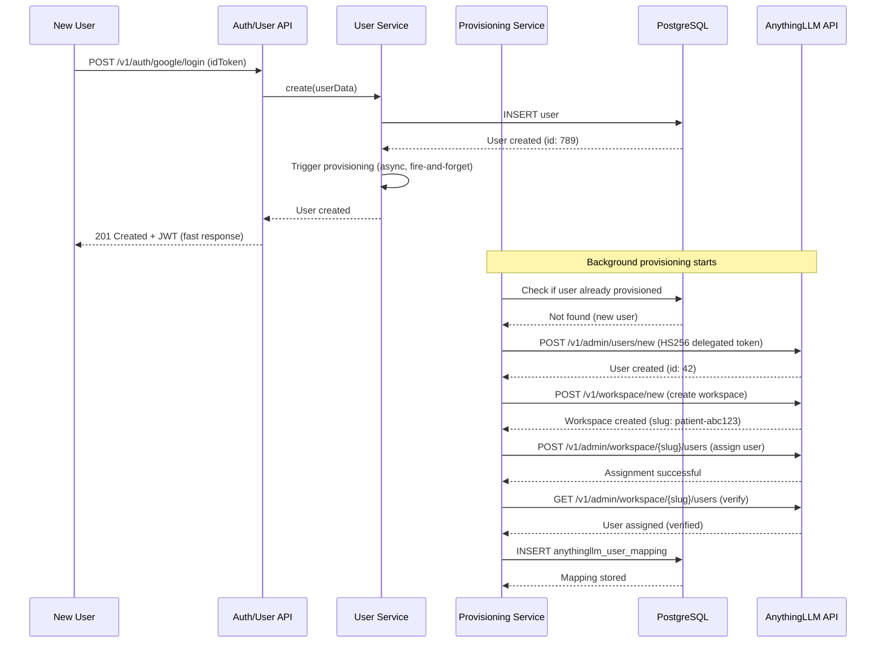

# AnythingLLM User Provisioning: API Description & Hosting Impact

## Executive Summary

The **AnythingLLM User Provisioning Service** automatically creates users, workspaces, and assignments in AnythingLLM when users are created in Keystone Core API. It runs **asynchronously** (fire-and-forget) and includes retry logic with exponential backoff.

**Key Impact on Hosting:**
- **Asynchronous execution:** Doesn't block user creation requests (fire-and-forget)
- **External API calls:** Makes 2-5 HTTP requests to AnythingLLM API per user
- **Database writes:** Stores user mappings (idempotent checks)
- **Retry logic:** Can extend provisioning time up to 7-10 seconds (1s + 2s + 4s delays)
- **Background load:** Adds sustained background work during user registration bursts

---

## 1. What is Provisioning?

### Purpose

When a user signs up or is created in Keystone Core API, the system automatically:
1. **Creates the user** in AnythingLLM (with mapped role)
2. **Creates a workspace** for the user (using hashed user ID as slug)
3. **Assigns the user to their workspace** (for default users)
4. **Stores a mapping** between Keystone user ID and AnythingLLM user ID
5. **Syncs status changes** (suspension, deletion) to AnythingLLM

### Why It Exists

- **Seamless UX:** Users don't need to manually configure AnythingLLM accounts
- **HIPAA Compliance:** Maintains audit trail of user creation and workspace assignment
- **Idempotency:** Prevents duplicate provisioning if user already exists
- **Role Mapping:** Automatically maps Keystone roles (admin, manager, user) to AnythingLLM roles

---

## 2. API Endpoints That Trigger Provisioning

### Primary Triggers

Provisioning is triggered by **any endpoint that creates a user**:

| Endpoint | Method | Description | Admin Context? |
|----------|--------|-------------|----------------|
| `/v1/auth/email/register` | POST | Email/password registration | ❌ No (uses system admin ID: 1) |
| `/v1/auth/google/login` | POST | Google OAuth (new user) | ❌ No (uses system admin ID: 1) |
| `/v1/auth/apple/login` | POST | Apple OAuth (new user) | ❌ No (uses system admin ID: 1) |
| `/v1/users` | POST | Admin creates user | ✅ Yes (uses admin ID from JWT) |

### Secondary Triggers

Provisioning also responds to status changes:

| Endpoint | Method | Description | Impact |
|----------|--------|-------------|--------|
| `/v1/users/:id` | PATCH | Update user status | Syncs suspension/activation to AnythingLLM |
| `/v1/users/:id` | DELETE | Delete user | Triggers suspension sync before soft-delete |

### Fire-and-Forget Pattern

```typescript
// From UsersService.create()
// Trigger AnythingLLM provisioning asynchronously
// Fire-and-forget: don't await, log errors if provisioning service rejects
this.anythingllmProvisioningService
  .provisionUser(user, adminUserId)
  .catch((error) => {
    // Log error but don't fail user creation
    this.logger.error(`Failed to provision user: ${error.message}`);
  });

return user; // User creation returns immediately
```

**Key Point:** User creation endpoint returns **immediately** (typically < 200ms). Provisioning happens **in the background** and can take 1-10 seconds.

---

## 3. How Provisioning Works

### Complete Flow (6 Steps)



### Step-by-Step Breakdown

#### Step 1: User Creation Check (Idempotency)
- **Action:** Check if user already exists in AnythingLLM (by `externalId`)
- **Time:** ~100-300ms (HTTP GET to AnythingLLM)
- **DB Impact:** 1 SELECT query (check mapping repository)

#### Step 2: Create User in AnythingLLM
- **Action:** `POST /v1/admin/users/new` to AnythingLLM
- **Payload:** Username, password (random), role (mapped from Keystone), externalId, externalProvider
- **Time:** ~200-500ms (HTTP POST + AnythingLLM processing)
- **Auth:** HS256 delegated token (from admin context or system admin)

#### Step 3: Create Workspace
- **Action:** `POST /v1/workspace/new` to AnythingLLM
- **Payload:** Workspace slug (hashed user ID), name
- **Time:** ~300-800ms (HTTP POST + AnythingLLM processing)
- **Retry Logic:** 3 attempts with exponential backoff (1s, 2s, 4s delays)

#### Step 4: Assign User to Workspace
- **Action:** `POST /v1/admin/workspace/{slug}/users` to AnythingLLM
- **Payload:** User ID, workspace slug
- **Time:** ~200-400ms (HTTP POST)
- **Conditional:** Only for default users (admin/manager have access to all workspaces)

#### Step 5: Verify Assignment
- **Action:** `GET /v1/admin/workspace/{slug}/users` to AnythingLLM
- **Time:** ~100-300ms (HTTP GET)
- **Conditional:** Only for default users

#### Step 6: Store Mapping
- **Action:** INSERT into `anythingllm_user_mappings` table
- **Payload:** keystoneUserId, anythingllmUserId, workspaceSlug
- **Time:** ~50-150ms (DB write)
- **DB Impact:** 1 INSERT query

### Total Time Estimates

| Scenario | Time | Breakdown |
|----------|------|-----------|
| **Happy path (no retries)** | 1-2 seconds | Steps 1-6 complete successfully |
| **With 1 retry (workspace creation)** | 2-3 seconds | 1s delay + retry |
| **With 2 retries (workspace creation)** | 4-6 seconds | 1s + 2s delays + retries |
| **With 3 retries (workspace creation)** | 7-10 seconds | 1s + 2s + 4s delays + retries |

---

## 4. Retry Logic & Error Handling

### Retry Configuration

```typescript
// From AnythingLLMUserProvisioningService
const maxRetries = 3;
const retryDelayMs = 1000; // 1 second base delay
const retryableStatusCodes = [500, 502, 503, 504, 408]; // Timeout, server errors

// Exponential backoff delays:
// Attempt 1: 0ms delay (immediate)
// Attempt 2: 1000ms delay (1 second)
// Attempt 3: 2000ms delay (2 seconds)
// Attempt 4: 4000ms delay (4 seconds, if maxRetries = 4)
```

### Retry Behavior

**Workspace Creation:**
- Retries up to 3 times on transient failures (500, 502, 503, 504, 408)
- Exponential backoff: 1s → 2s → 4s
- Total max time: ~7-10 seconds if all retries are exhausted

**User Creation:**
- No retry logic (relies on idempotency check)
- If user already exists, returns existing ID
- If creation fails, throws error (logged but doesn't block user creation)

**Assignment:**
- No retry logic (idempotent operation)
- If already assigned, returns success

### Error Handling

- **Provisioning failures don't block user creation:** User is created in Keystone even if AnythingLLM provisioning fails
- **Errors are logged:** All failures are logged to audit service
- **Mapping is only stored on success:** If provisioning fails, no mapping is created (allows retry on next attempt)
- **Idempotency:** Re-running provisioning for existing user returns existing mapping

---

## 5. Capacity Planning Impact

### Background Load Characteristics

#### Per-User Provisioning Load

| Resource | Impact | Duration |
|----------|--------|----------|
| **HTTP Requests** | 2-5 requests to AnythingLLM | 1-10 seconds |
| **Database Queries** | 2-3 queries (SELECT + INSERT) | ~150-450ms |
| **Memory** | Minimal (~10-20 MB per concurrent provisioning) | Temporary |
| **CPU** | Low (I/O-bound, async operations) | Intermittent |
| **Network** | ~5-10 KB request/response payloads | Burst |

#### Aggregate Load Patterns

**Steady State (Normal User Signups):**
- **Assumption:** 10-20 new users per hour (typical for 200-250 concurrent users)
- **Provisioning rate:** 10-20 provisioning operations/hour
- **Average load:** ~0.003-0.006 provisioning operations/second
- **Impact:** Negligible (background work handled by existing instances)

**Burst Scenarios (User Registration Spikes):**

| Scenario | Users/Minute | Provisioning/Minute | Impact |
|----------|--------------|---------------------|--------|
| **Normal** | 0.2-0.3 | 0.2-0.3 | ✅ Minimal |
| **Marketing Campaign** | 10-20 | 10-20 | 🟡 Moderate (2-5 concurrent provisioning) |
| **Onboarding Batch** | 50-100 | 50-100 | 🔴 High (10-20 concurrent provisioning) |

### Resource Consumption Per Provisioning

**Database:**
- **Queries:** 2-3 queries per provisioning (SELECT + INSERT)
- **Connections:** 1 connection for ~150-450ms (idempotency check + mapping storage)
- **Total:** ~0.01-0.02 database seconds per provisioning

**HTTP Requests (to AnythingLLM):**
- **Requests:** 2-5 requests per provisioning
- **Payload:** ~5-10 KB total (requests + responses)
- **Duration:** 1-10 seconds (depending on retries)
- **Total:** Minimal network impact

**Memory:**
- **Per provisioning:** ~10-20 MB (temporary, during async execution)
- **Concurrent provisioning:** ~10-20 MB × number of concurrent operations
- **Example:** 10 concurrent provisioning = ~100-200 MB temporary memory

**CPU:**
- **Per provisioning:** Very low (I/O-bound, async operations)
- **Total:** Negligible CPU impact (handled by existing instances)

---

## 6. Hosting Considerations for 200-250 Concurrent Users

### Current Capacity Assessment

**Assumptions:**
- 200-250 concurrent users (not "registered users")
- New user signup rate: ~10-20 users/hour (typical)
- Peak signup rate: ~50-100 users/hour (during onboarding/marketing campaigns)

### Impact on Cloud Run Instances

#### Background Work Load

**Normal Operation (10-20 users/hour):**
- **Provisioning rate:** ~0.003-0.006 ops/sec
- **Concurrent provisioning:** < 1 (provisioning completes faster than new users arrive)
- **Impact:** ✅ Negligible (handled by existing instances)

**Peak Operation (50-100 users/hour):**
- **Provisioning rate:** ~0.014-0.028 ops/sec
- **Concurrent provisioning:** ~2-5 (provisioning takes 1-10 seconds)
- **Impact:** 🟡 Moderate (adds ~50-200 MB memory temporarily, minimal CPU)

#### Instance Count Impact

**With 2-15 Cloud Run instances (as planned):**
- **Background provisioning:** Distributed across instances
- **Each instance:** Handles ~0.5-7.5 provisioning operations concurrently
- **Memory per instance:** ~5-150 MB additional temporary memory during bursts
- **Result:** ✅ No additional instances needed (within existing capacity)

### Impact on Database (Cloud SQL)

#### Connection Pool Impact

**Per Provisioning:**
- **Queries:** 2-3 queries (SELECT + INSERT)
- **Duration:** ~150-450ms
- **Connections:** 1 connection for ~150-450ms

**Peak Load (50-100 users/hour = 0.014-0.028 ops/sec):**
- **Concurrent provisioning:** ~2-5 operations
- **DB connections needed:** ~2-5 connections (from existing pool of 15 per instance)
- **Total across 15 instances:** ~30-75 connections (within 250 max_connections limit)

**Result:** ✅ No database connection pool adjustment needed

#### Database Query Load

**Additional queries from provisioning:**
- **Steady state:** ~0.006-0.012 queries/sec (minimal)
- **Peak:** ~0.042-0.084 queries/sec (still minimal compared to main API load)
- **Impact:** ✅ Negligible (provisioning queries are simple SELECT/INSERT)

### Impact on AnythingLLM API

**Important:** Provisioning makes external HTTP requests to AnythingLLM API. This is **not** handled by Keystone Core API capacity planning, but should be considered:

- **AnythingLLM must handle:** 10-100 provisioning requests/hour during normal/peak
- **AnythingLLM response time:** Should be < 500ms per request (currently ~200-800ms observed)
- **AnythingLLM rate limiting:** Should allow 10-20 requests/minute from Keystone service account

---

## 7. Recommended Hosting Configuration

### Cloud Run Configuration (No Changes Needed)

The existing capacity planning configuration handles provisioning:

| Setting | Value | Rationale |
|---------|-------|-----------|
| **Min Instances** | 2 | Handles steady-state provisioning |
| **Max Instances** | 15 | Handles provisioning bursts (distributed load) |
| **CPU** | 2 vCPU | Sufficient for I/O-bound provisioning work |
| **Memory** | 2 GB | Sufficient (provisioning adds ~50-200 MB during bursts) |
| **Concurrency** | 50 | Handles provisioning + main API requests |

**Result:** ✅ No configuration changes needed

### Database Configuration (No Changes Needed)

The existing database configuration handles provisioning:

| Setting | Value | Rationale |
|---------|-------|-----------|
| **max_connections** | 250 | Sufficient (provisioning needs ~2-5 connections during bursts) |
| **Pool per instance** | 15 | Sufficient (provisioning uses 1 connection per operation) |
| **Tier** | db-custom-2-8192 | Sufficient (provisioning queries are simple) |

**Result:** ✅ No database configuration changes needed

### Monitoring & Alerting (Additions)

**Add monitoring for provisioning:**

| Metric | Threshold | Action |
|--------|-----------|--------|
| **Provisioning failure rate** | > 5% | Alert (investigate AnythingLLM API health) |
| **Provisioning duration p95** | > 10 seconds | Alert (AnythingLLM API slow or retries exhausted) |
| **Concurrent provisioning** | > 20 | Warn (high signup rate, verify AnythingLLM capacity) |
| **Provisioning queue depth** | > 50 | Alert (provisioning not keeping up with signups) |

**Note:** Current implementation doesn't expose these metrics (TODO: add Prometheus/metrics export).

---

## 8. Optimization Recommendations

### Current Implementation (Good)

✅ **Fire-and-forget pattern:** User creation doesn't block on provisioning  
✅ **Retry logic:** Handles transient failures gracefully  
✅ **Idempotency:** Prevents duplicate provisioning  
✅ **Async execution:** Doesn't impact API response times  

### Potential Improvements (Future)

1. **Bounded Async Executor (TODO):**
   - Current TODO: "Use bounded async executor to prevent unbounded parallelism during bulk user creation"
   - **Impact:** Prevents memory exhaustion if 100+ users are created simultaneously
   - **Implementation:** Use `p-queue` or similar to limit concurrent provisioning (e.g., max 10 concurrent)

2. **Provisioning Queue (Optional):**
   - Move provisioning to a queue (Cloud Tasks, Pub/Sub) for better control
   - **Benefits:** Rate limiting, retry control, monitoring visibility
   - **Cost:** Additional GCP service (~$0.40 per million operations)

3. **Metrics Export (Recommended):**
   - Export provisioning metrics (duration, success rate, queue depth) to Cloud Monitoring
   - **Benefits:** Better visibility, alerting, capacity planning
   - **Implementation:** Add Prometheus client or Cloud Monitoring export

4. **Batch Provisioning (Future):**
   - If bulk user import is needed (1000+ users), implement batch provisioning endpoint
   - **Benefits:** Rate limiting, progress tracking, better error handling
   - **Use case:** Enterprise onboarding, migration scenarios

---

## 9. Scaling Beyond 250 Users

### When Signup Rate Increases

**If signup rate grows to 200+ users/hour:**

| Metric | Impact | Recommendation |
|--------|--------|----------------|
| **Concurrent provisioning** | 5-10 operations | ✅ Still manageable (within existing capacity) |
| **Database connections** | 5-10 connections | ✅ Still within pool capacity |
| **Memory** | ~100-200 MB additional | ✅ Still within 2 GB per instance |

**If signup rate grows to 500+ users/hour:**

| Metric | Impact | Recommendation |
|--------|--------|----------------|
| **Concurrent provisioning** | 10-20 operations | 🟡 Consider bounded executor (limit to 10 concurrent) |
| **Database connections** | 10-20 connections | 🟡 Still within pool, but monitor |
| **Memory** | ~200-400 MB additional | 🟡 Monitor memory utilization |

**If signup rate grows to 1000+ users/hour:**

| Metric | Impact | Recommendation |
|--------|--------|----------------|
| **Concurrent provisioning** | 20-40 operations | 🔴 Implement queue (Cloud Tasks) or bounded executor |
| **Database connections** | 20-40 connections | 🔴 May need pool increase or rate limiting |
| **Memory** | ~400-800 MB additional | 🔴 Consider dedicated worker instances |

### Scaling Strategy

1. **First:** Monitor provisioning metrics (add Prometheus/Cloud Monitoring export)
2. **Second:** Implement bounded async executor (limit concurrent provisioning to 10-20)
3. **Third:** Move to queue-based provisioning (Cloud Tasks) if signup rate > 500/hour
4. **Fourth:** Dedicated worker instances only if signup rate > 2000/hour (rare)

---

## 10. Summary & Action Items

### Current State ✅

- **Provisioning is production-ready:** Fire-and-forget, retry logic, idempotency all working
- **Capacity impact is minimal:** Handled by existing Cloud Run + Cloud SQL configuration
- **No immediate changes needed:** Current hosting plan (200-250 concurrent users) is sufficient

### Hosting Impact Summary

| Aspect | Impact | Status |
|--------|--------|--------|
| **Cloud Run instances** | Minimal (background work) | ✅ No changes needed |
| **Cloud Run memory** | +50-200 MB during bursts | ✅ Within 2 GB capacity |
| **Cloud Run CPU** | Minimal (I/O-bound) | ✅ No changes needed |
| **Database connections** | +2-5 connections during bursts | ✅ Within 250 limit |
| **Database queries** | +0.006-0.084 queries/sec | ✅ Negligible |
| **Network (AnythingLLM)** | ~5-10 KB per provisioning | ✅ Not a concern |

### Action Items (Optional Improvements)

1. **Add monitoring:** Export provisioning metrics to Cloud Monitoring (duration, success rate, queue depth)
2. **Implement bounded executor:** Prevent unbounded parallelism during bulk user creation (TODO in code)
3. **Add alerting:** Alert on provisioning failure rate > 5% or duration p95 > 10 seconds
4. **Document AnythingLLM requirements:** Ensure AnythingLLM can handle 10-100 requests/hour with < 500ms response time

### Key Takeaways

- ✅ **Provisioning doesn't require capacity adjustments** for 200-250 concurrent users
- ✅ **Background load is minimal** compared to main API traffic
- ✅ **Fire-and-forget pattern** ensures user creation response times are not impacted
- ✅ **Retry logic** handles transient failures gracefully
- 🟡 **Monitor provisioning metrics** as user base grows
- 🟡 **Implement bounded executor** if bulk user creation is needed

---

## Appendix: Provisioning Code Locations

### Key Files

- **Service:** `src/anythingllm/provisioning/anythingllm-user-provisioning.service.ts`
- **Module:** `src/anythingllm/provisioning/anythingllm-provisioning.module.ts`
- **Integration:** `src/users/users.service.ts` (line 138-149)
- **Tests:** `test/anythingllm/user-provisioning.e2e-spec.ts`
- **Architecture Doc:** `docs/architecture/temporary-manager-and-anythingllm-integration.md`

### Database Schema

```sql
-- anythingllm_user_mappings table
CREATE TABLE anythingllm_user_mappings (
  id SERIAL PRIMARY KEY,
  keystone_user_id VARCHAR(255) NOT NULL UNIQUE,
  anythingllm_user_id INTEGER NOT NULL,
  workspace_slug VARCHAR(255) NOT NULL,
  created_at TIMESTAMP DEFAULT CURRENT_TIMESTAMP,
  updated_at TIMESTAMP DEFAULT CURRENT_TIMESTAMP
);

CREATE INDEX idx_keystone_user_id ON anythingllm_user_mappings(keystone_user_id);
CREATE INDEX idx_anythingllm_user_id ON anythingllm_user_mappings(anythingllm_user_id);
```
