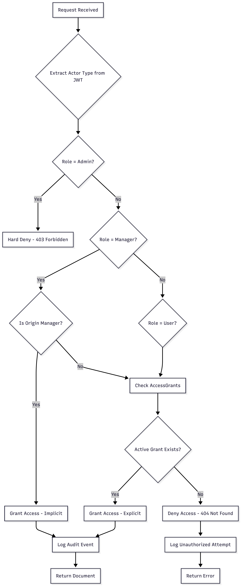
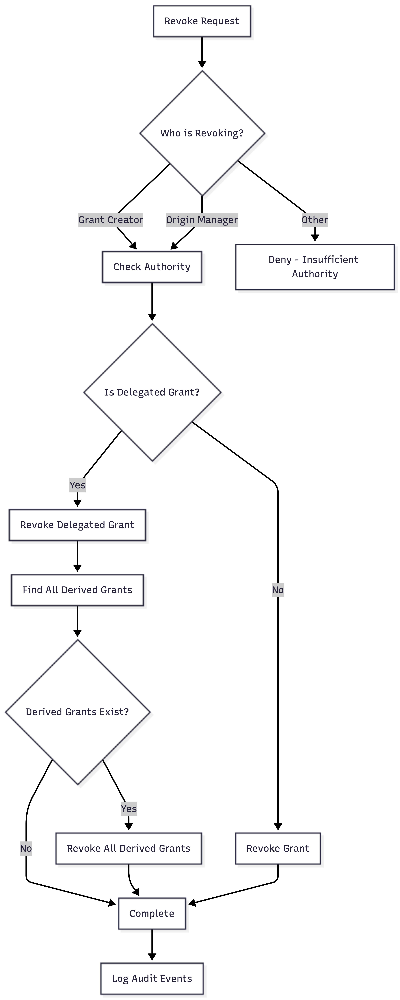

# Document Identity Management and Role System Architecture Report

**Document Version**: 1.0  
**Generated**: Dec 2025  
**Classification**: Internal - System Architecture Documentation  
**Purpose**: Comprehensive overview of the Document Identity Management Platform and Role-based Access Control system

---

## Executive Summary

The Keystone Core API implements a HIPAA-compliant Document Identity Management Platform that uses an origin-centered, AccessGrant-driven architecture for document custody and access control. The system separates document custodianship from user access through a sophisticated role-based authorization model that enforces strict boundaries between administrative functions, manager custodial authority, and user-level document access.

This report describes how the Document Identity Management system works, how the Role System enforces authorization boundaries, and how these two systems interact to create a secure, auditable, and HIPAA-compliant document management platform.

---

## Table of Contents

1. [System Architecture Overview](#1-system-architecture-overview)
2. [Document Identity Management System](#2-document-identity-management-system)
3. [Role System Architecture](#3-role-system-architecture)
4. [Integration: How Document Identity and Roles Work Together](#4-integration-how-document-identity-and-roles-work-together)
5. [Access Control Flow](#5-access-control-flow)
6. [Authorization Enforcement Model](#6-authorization-enforcement-model)
7. [Implementation Evolution](#7-implementation-evolution)
8. [Key Design Principles](#8-key-design-principles)

---

## 1. System Architecture Overview

### 1.1 Core Philosophy

The system is built on three foundational principles:

**Origin-Centered Custodianship**: Every document has exactly one origin manager who holds immutable custodial authority over that document. This manager is assigned at document creation and cannot be changed. This model mirrors real-world healthcare document custody patterns where a healthcare provider (manager) is the legal custodian of medical records.

**AccessGrant-Driven Permissions**: Documents are not owned by users. Instead, access to documents flows through explicit access grants. Users and secondary managers receive access through grants, while the origin manager has implicit access based on custodial authority. This separation allows for fine-grained access control and clear audit trails.

**Role-Based Authorization Boundaries**: The role system creates strict boundaries between different actor types. Administrators manage system configuration but have no document-level access. Managers can be custodians and can receive access grants as secondary managers. Users can upload documents (acting as intake agents) and receive access grants but cannot be custodians themselves.

### 1.2 System Components

The platform consists of several interconnected systems:

- **Authentication System**: Mobile-first OAuth 2.0 flow supporting Google Sign-In and Apple Sign-In, producing short-lived access tokens and long-lived refresh tokens tied to database sessions.

- **Document Processing System**: Handles document upload, storage in Google Cloud Storage, OCR processing via Google Document AI, and extraction of structured fields from documents.

- **Access Control System**: Implements AccessGrant resolution, origin manager authority validation, and role-based permission checks.

- **Manager Management System**: Handles manager onboarding, verification, and the directory of verified healthcare providers.

- **User-Manager Assignment System**: Manages governance relationships between users and their assigned managers (separate from document access).

- **Audit System**: Logs all document access, authority changes, and administrative actions without storing Protected Health Information (PHI).

---

## 2. Document Identity Management System

### 2.1 Document Entity Structure

Every document in the system contains several critical identity fields that determine its custodianship and access patterns:

**Origin Manager ID (Immutable)**: This is the single most important field in the document identity model. Set exactly once at document creation, this field identifies which manager entity holds custodial authority over the document. This field is immutable - it cannot be updated after creation. This immutability ensures an unbroken audit trail and prevents unauthorized transfers of custodianship.

**Origin User Context ID (Optional)**: When a user uploads a document, their user ID is stored in this field for intake tracking purposes. This field is optional because managers can also upload documents directly. When present, it provides context about who initiated the document intake process, but it does not confer ownership rights. This field is only visible to the origin manager and system auditors.

**Document Type**: Classifies the document (lab result, prescription, medical record, etc.) for organizational and filtering purposes.

**Status**: Tracks the document's lifecycle state (UPLOADED, STORED, PROCESSING, PROCESSED, ERROR).

**Storage References**: Contains Google Cloud Storage URIs for the raw file and processed OCR output.

**Retention Metadata**: Includes scheduled deletion timestamp based on HIPAA retention policies (default 8 years).

### 2.2 Document Lifecycle

The document lifecycle follows a state machine pattern with clear transitions:

**Upload Phase**: A document enters the system through upload. During upload, the system requires explicit selection of an origin manager. If a user uploads the document, they must select a verified manager from the directory or choose from previously used managers. If a manager uploads the document, they automatically become the origin manager. At this point, the document receives its immutable origin manager assignment.

**Storage Phase**: After successful upload, the document file is stored in Google Cloud Storage with encryption at rest. The document status transitions to STORED, indicating the file is securely persisted.

**Processing Phase**: The origin manager can trigger OCR processing, which extracts text and structured fields from the document. During processing, the status is PROCESSING, and progress may be tracked.

**Processed State**: Once OCR completes successfully, the document status becomes PROCESSED, and extracted fields become available for viewing and editing.

**Error Handling**: If processing fails, the document enters ERROR state. The origin manager can retry processing, with retry count limits to prevent infinite loops.

Throughout this lifecycle, the origin manager ID never changes. Even if the document is shared with other managers or users, the custodial authority remains with the original manager.

### 2.3 Access Grant System

Access to documents flows through an explicit AccessGrant system rather than ownership-based permissions. This design provides several advantages:

**Grant Types**: The system supports three grant types. Owner grants are created exclusively by origin managers and provide full access (view, download, re-share). Delegated grants are created by users who have access and want to share with others. Derived grants are automatically created when a manager receives a delegated grant, allowing cascade management of access hierarchies.

**Grant Resolution**: When checking if an actor has access to a document, the system first checks if the actor is the origin manager (implicit access). If not, it queries the AccessGrant table for active grants matching the actor type and ID. Multiple grants can exist for the same document and subject (from different grantors), and the union of all grants determines access.

**Grant Revocation**: Grants can be revoked by their creator or by the origin manager. When a delegated grant is revoked, all derived grants are automatically revoked (cascade revocation). This ensures that access hierarchies remain consistent.

**Audit Trail**: Every grant creation and revocation generates an audit event, creating a complete history of who had access to which documents and when.

### 2.4 Origin Manager Authority

The origin manager holds special custodial authority over their documents:

**Implicit Access**: Unlike other actors, the origin manager does not need an explicit AccessGrant to access their documents. The system automatically recognizes their authority based on the origin manager ID.

**Exclusive Privileges**: Only the origin manager can trigger OCR processing, update document metadata (filename, description, document type), and create owner-level access grants. They can also approve or deny revocation requests.

**Immutable Authority**: The origin manager assignment cannot be transferred. Once set at document creation, it becomes a permanent part of the document's identity.

**Custodial Responsibility**: The origin manager is the legal custodian of the document in the healthcare context, responsible for maintaining the integrity and security of the document according to HIPAA requirements.

---

## 3. Role System Architecture

### 3.1 Role Hierarchy

The system implements a three-tier role hierarchy with strict boundaries:

**Administrator Role (Level 1)**: Administrators have system-wide configuration authority. They can manage managers (create, verify, suspend), assign users to managers for governance relationships, view audit logs for compliance purposes, and configure system policies. However, administrators are explicitly excluded from all document-level operations. They cannot upload documents, view documents, download documents, or access any document metadata. This hard exclusion is enforced at both the guard level (before requests reach controllers) and the domain service level.

**Manager Role (Level 2)**: Managers are healthcare providers who can act as document custodians. They can upload documents (becoming the origin manager), trigger OCR processing for their documents, manage access grants for their documents, and receive access grants as secondary managers to access other managers' documents. Managers authenticate using the same OAuth infrastructure as users but are distinguished by their role assignment. Only verified managers can be selected as origin managers or appear in the manager directory.

**User Role (Level 3)**: Users are patients or individuals who can upload documents (acting as intake agents) with mandatory origin manager selection, receive and delegate access grants, view and download documents they have grants for, and request revocation of their own access. Users cannot be origin managers themselves and cannot trigger OCR processing or modify document metadata.

### 3.2 Role Assignment and Authentication

Roles are assigned at the user entity level through a ManyToOne relationship to a Role entity. The role ID is stored in the JWT payload, allowing authorization decisions to be made without database queries for every request.

When a user authenticates through the mobile-first OAuth flow, the system creates or finds their user record and loads their role. The role information is embedded in the JWT access token, which has a short lifetime (approximately 15 minutes). The role is also used to determine which endpoints and operations are accessible.

The authentication system supports multiple OAuth providers (Google, Apple) but maintains a unified user and role model. The distinction between managers and users happens at the role level, not at the authentication provider level.

### 3.3 Role Enforcement Points

Role-based authorization is enforced at multiple layers:

**Guard Level**: NestJS guards check role membership before requests reach controllers. The RolesGuard examines the role ID from the JWT payload and compares it against allowed roles specified in route decorators. If the role doesn't match, the request is rejected with a 403 Forbidden response before any business logic executes.

**Controller Level**: Controllers extract actor information (type and ID) from the authenticated request. They also perform explicit role checks for certain operations. For example, document upload endpoints check if the actor is an admin and immediately reject the request, as admins cannot interact with documents.

**Domain Service Level**: Domain services receive actor information (type and ID) and perform authorization checks based on both role and document access grants. For example, when checking document access, the service first verifies the actor is not an admin, then checks AccessGrant resolution or origin manager status.

### 3.4 Manager Verification System

Managers undergo a verification process before they can act as custodians:

**Verification States**: Managers start in a pending verification state. Administrators review manager information and can transition them to verified status. Verified managers can also be suspended, which revokes their ability to act as origin managers until they are re-verified.

**Verification Requirements**: Managers must provide identifying information including a display name (e.g., "Quest Diagnostics - Downtown Lab"), optional legal name, and at least one location identifier (either a full address or geographic coordinates). This information ensures managers are distinguishable and verifiable healthcare providers.

**Verification Impact**: Only verified managers can be selected as origin managers during document upload. Only verified managers appear in the manager directory that users browse when uploading documents. Unverified managers exist in the system but cannot participate in document custodianship.

---

## 4. Integration: How Document Identity and Roles Work Together

### 4.1 Document Upload Flow

When a document is uploaded, the Document Identity Management system and Role System work together to establish custodianship:

**User Upload Flow**: A user with role "user" uploads a document. The system requires them to select an origin manager from the verified manager directory. The selected manager must be in verified status. The document is created with the user's ID in the origin user context field and the selected manager's ID in the origin manager field. A default delegated access grant is automatically created for the uploading user, allowing them immediate access to the document they uploaded.

**Manager Upload Flow**: A user with role "manager" uploads a document. The system automatically assigns them as the origin manager. Their manager entity ID is stored in the origin manager field. No explicit access grant is needed for the uploading manager, as they have implicit access through custodial authority.

**Admin Exclusion**: If a user with role "admin" attempts to upload a document, the request is rejected at the controller level before any document processing occurs. This hard exclusion prevents admins from entering document workflows entirely.

### 4.2 Access Resolution Flow

When an actor requests to view or download a document, both systems collaborate to determine access:

**Actor Type Determination**: The system first extracts the actor type from the request. The role determines whether the actor is an admin (which immediately denies document access), a manager, or a user.

**Origin Manager Check**: If the actor is a manager, the system checks if the document's origin manager ID matches the manager's entity ID. If there's a match, access is granted immediately without querying AccessGrants. This is the implicit access mechanism for custodians.

**AccessGrant Resolution**: If the actor is not the origin manager, the system queries the AccessGrant table for active grants matching the document ID, actor type, and actor ID. If an active grant exists, access is granted.

**Role-Based Restrictions**: Even with access, role-based restrictions apply. For example, secondary managers can view documents but cannot edit extracted fields (only users can edit fields for corrections). Origin managers have exclusive authority to trigger OCR processing.

**Audit Logging**: All access attempts are logged, including the actor type, actor ID, document ID, origin manager ID, and whether access was granted. This creates a complete audit trail of who accessed what documents when.

### 4.3 User-Manager Assignment vs Document Access

A critical distinction in the system is the separation between User-Manager Assignments and Document AccessGrants:

**User-Manager Assignment**: This is a governance or supervision relationship managed by administrators. When a user is assigned to a manager, it establishes a care team or oversight relationship. However, this assignment does NOT automatically grant the manager access to the user's documents. This separation prevents over-permissioning and ensures fine-grained access control.

**Document AccessGrants**: Document access is controlled exclusively through AccessGrants. A manager who is assigned to a user still needs explicit AccessGrants to view or download that user's documents. This two-step process (assignment for governance, grant for access) provides defense-in-depth security and clear audit semantics.

**Why This Separation Matters**: In healthcare scenarios, a user might be assigned to multiple managers for different purposes (primary care, specialist, lab coordinator). Not all assigned managers need access to all documents. The AccessGrant system allows fine-grained control: a manager might have access to lab results but not to psychiatric notes, even though they are assigned to the user for care coordination.

---

## 5. Access Control Flow

The following diagram illustrates how document access is determined when an actor requests to view a document:

### 5.1 Authorization Decision Tree

The access control flow follows a hierarchical decision tree:

**Level 1: Role Exclusion**: Admins are immediately excluded from document access. This check happens at the guard level before any domain logic executes.

**Level 2: Origin Manager Recognition**: If the actor is a manager, the system checks if they are the origin manager for the requested document. This check uses the immutable origin manager ID stored in the document entity.

**Level 3: AccessGrant Resolution**: If the actor is not the origin manager, the system queries AccessGrants. The query matches document ID, actor type (user or manager), and actor ID. Only active grants (those without a revocation timestamp) are considered.

**Level 4: Operation-Specific Permissions**: Even with access, certain operations require additional authorization. For example, only the origin manager can trigger OCR processing, and only users (not managers) can edit extracted fields.

### 5.2 Cascade Revocation Flow

When an access grant is revoked, the system performs cascade revocation to maintain consistency:

This cascade ensures that if a user revokes access they granted, all downstream grants (including those created by secondary managers) are also revoked, preventing orphaned access permissions.

---

## 6. Authorization Enforcement Model

### 6.1 Multi-Layer Enforcement

The system enforces authorization at three distinct layers, providing defense-in-depth security:

**Layer 1: Guard-Level Enforcement**: NestJS guards intercept requests before they reach controllers. The JWT guard validates token signature and expiration. The Roles guard checks role membership against route decorators. A custom Document Access guard explicitly rejects admin requests to document endpoints. At this layer, unauthorized requests are rejected with appropriate HTTP status codes without executing any business logic.

**Layer 2: Controller-Level Enforcement**: Controllers extract actor information and perform explicit role checks for sensitive operations. They transform HTTP requests into domain service calls with actor context. Controllers also handle input validation and response transformation.

**Layer 3: Domain Service-Level Enforcement**: Domain services contain the core business logic and perform final authorization checks based on both role and document access grants. They use AccessGrant resolution services to determine access and origin manager authority validation to check custodial privileges. Domain services also generate audit events for all access attempts and successful operations.

### 6.2 Audit Integration

Every authorization decision generates an audit event:

**Access Events**: When an actor successfully accesses a document, an audit event is created containing the actor type, actor ID, document ID, origin manager ID, access type (implicit origin vs explicit grant), and timestamp. No PHI is included in audit logs - only identifiers and metadata.

**Authorization Failure Events**: When an unauthorized access attempt occurs, an audit event is created with the same structure but marked as unsuccessful. This allows security teams to detect and investigate potential unauthorized access attempts.

**Authority Change Events**: When access grants are created or revoked, audit events capture who performed the action, what grant was affected, and why (if applicable). This creates a complete history of document access changes.

**Compliance**: All audit events are designed to meet HIPAA audit log requirements. They are stored synchronously (not asynchronously) to ensure integrity, and they are forwarded to Google Cloud Logging for long-term retention and compliance reporting.

---

## 7. Implementation Evolution

### 7.1 Phase 0: Domain Modeling

The system design began with Phase 0, which established the core domain model. This phase defined the origin-centered document model, the AccessGrant system, and the separation between document custodianship and user access. The domain model explicitly rejected ownership-based approaches in favor of the AccessGrant-driven model.

### 7.2 Phase 1: Access Control Design

Phase 1 defined the complete access control matrix, specifying exactly which roles could perform which operations on documents. This phase established the rule that administrators have no document-level access and that origin managers have implicit access while all other access requires explicit grants.

### 7.3 Phase 2: Document Lifecycle Design

Phase 2 defined the document state machine, OCR processing authority (exclusive to origin managers), and retention policies. This phase established that only origin managers can trigger OCR and that documents follow a strict lifecycle with immutable origin manager assignment throughout.

### 7.4 Phase 3: API Surface Design

Phase 3 specified all 21 REST API endpoints, their authorization requirements, request/response contracts, and side effects. This phase ensured that the API surface aligned with the domain model and access control design.

### 7.5 Phase 4: Audit & HIPAA Strategy

Phase 4 defined the complete audit event taxonomy, log schema, and retention requirements. This phase ensured all authorization decisions and document operations generate appropriate audit events without storing PHI.

### 7.6 Phase 5: Implementation

Phase 5 involved the incremental implementation of all previously designed components:

**Phase 5.1**: Implementation of manager entities and role system, including the manager role addition and UserManagerAssignment entities.

**Phase 5.2**: Implementation of AccessGrant system with repository, domain services, and access resolution logic.

**Phase 5.3**: Implementation of document lifecycle state machine, OCR authority enforcement, and retention policy integration.

**Phase 5.4**: Implementation of all API endpoints, including document endpoints, access grant endpoints, revocation request endpoints, and manager assignment endpoints.

**Phase 5.5**: Implementation of complete audit event taxonomy, PHI sanitization in logs, and GCP Cloud Logging integration.

### 7.7 Key Implementation Decisions

Throughout implementation, several critical decisions were made:

**Immutable Origin Manager**: The decision to make origin manager ID immutable was fundamental to the security model. This ensures an unbreakable audit trail and prevents unauthorized transfers of custodianship.

**Hard Admin Exclusion**: The decision to hard-deny admins from all document operations (rather than allowing silent bypass) was made to enforce the principle of least privilege and ensure clear audit semantics.

**AccessGrant vs Assignment Separation**: The decision to separate User-Manager Assignments (governance) from AccessGrants (document access) was made to prevent over-permissioning and enable fine-grained access control.

**Cascade Revocation**: The decision to automatically cascade revocation of derived grants when delegated grants are revoked ensures access hierarchies remain consistent and prevents orphaned permissions.

---

## 8. Key Design Principles

### 8.1 Origin-Centered Authority

The most fundamental principle is that documents have immutable custodial authority vested in a single origin manager. This principle ensures:

- Clear legal custody chain for HIPAA compliance
- Immutable audit trail of who holds custodial responsibility
- Consistent authority resolution (no ambiguity about who can make decisions)
- Alignment with real-world healthcare document custody patterns

### 8.2 AccessGrant-Driven Permissions

Documents are not owned by users; access flows through explicit grants. This principle ensures:

- Fine-grained access control (each grant can have different permissions)
- Clear audit trail of who granted access to whom
- Support for complex access hierarchies (delegated and derived grants)
- Separation of custodianship from access (a user can have access without being the custodian)

### 8.3 Role-Based Boundaries

Strict boundaries between roles prevent privilege escalation and enforce least privilege:

- Administrators have system-level authority but no document access
- Managers can be custodians and can receive access grants as secondary managers
- Users can upload documents (intake) and receive/delegate access but cannot be custodians
- These boundaries are enforced at multiple layers (guards, controllers, domain services)

### 8.4 Defense in Depth

Multiple layers of authorization checks provide redundancy:

- Guard-level checks reject unauthorized requests early
- Controller-level checks validate actor type and role
- Domain service-level checks validate both role and AccessGrant status
- Audit logging captures all authorization decisions for compliance

### 8.5 HIPAA Compliance

All design decisions prioritize HIPAA compliance:

- No PHI in logs (only identifiers and metadata)
- Complete audit trail of all document access and authority changes
- Encryption at rest for documents and database
- Retention policies aligned with HIPAA requirements (8 years default)
- Access controls that enforce minimum necessary access

### 8.6 Immutability Where It Matters

Critical fields are immutable to ensure audit integrity:

- Origin manager ID cannot change after document creation
- Audit events are never updated or deleted
- AccessGrant revocation creates new state rather than deleting records
- These immutability guarantees ensure an unbreakable audit trail

---

## Conclusion

The Document Identity Management and Role System work together to create a secure, auditable, and HIPAA-compliant platform for managing healthcare documents. The origin-centered custodianship model ensures clear legal custody chains, while the AccessGrant-driven permission model enables fine-grained access control. The role system enforces strict boundaries between different actor types, preventing privilege escalation and ensuring least privilege.

The separation of concerns - between custodianship (origin manager) and access (AccessGrants), between governance (User-Manager Assignments) and document access, and between system administration and document operations - creates a robust architecture that can scale while maintaining security and compliance.

The implementation has evolved through a careful phase-by-phase design process, with each phase building on the previous ones to create a cohesive system. The multi-layer authorization enforcement, comprehensive audit logging, and immutable authority model ensure that the platform meets the stringent requirements of healthcare document management.

---

**Document Status**: Complete  
**Next Review**: When significant architecture changes are implemented  
**Related Documents**:

- Phase 0-3 Design Documents (`docs/phase-0-domain-modeling.md`, etc.)
- Manager Role Architecture (`docs/manager-role-architecture.md`)
- API Surface Design (`docs/phase-3-api-surface-design.md`)
