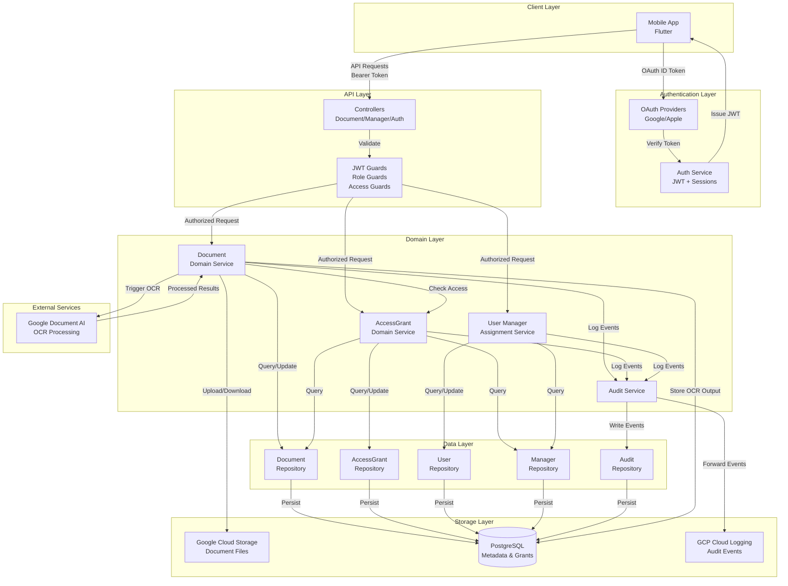
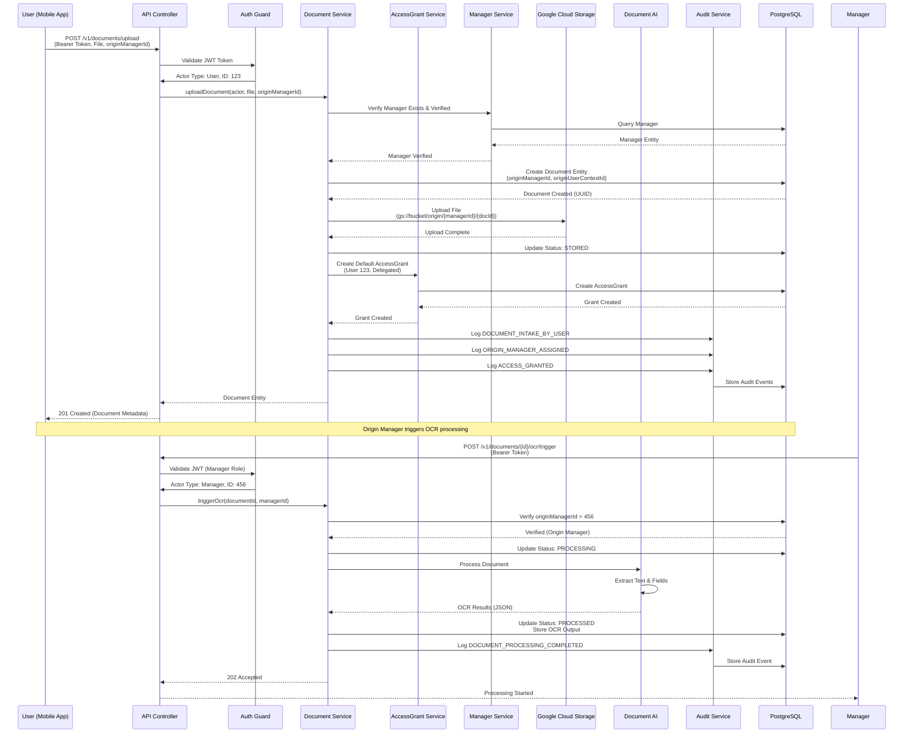
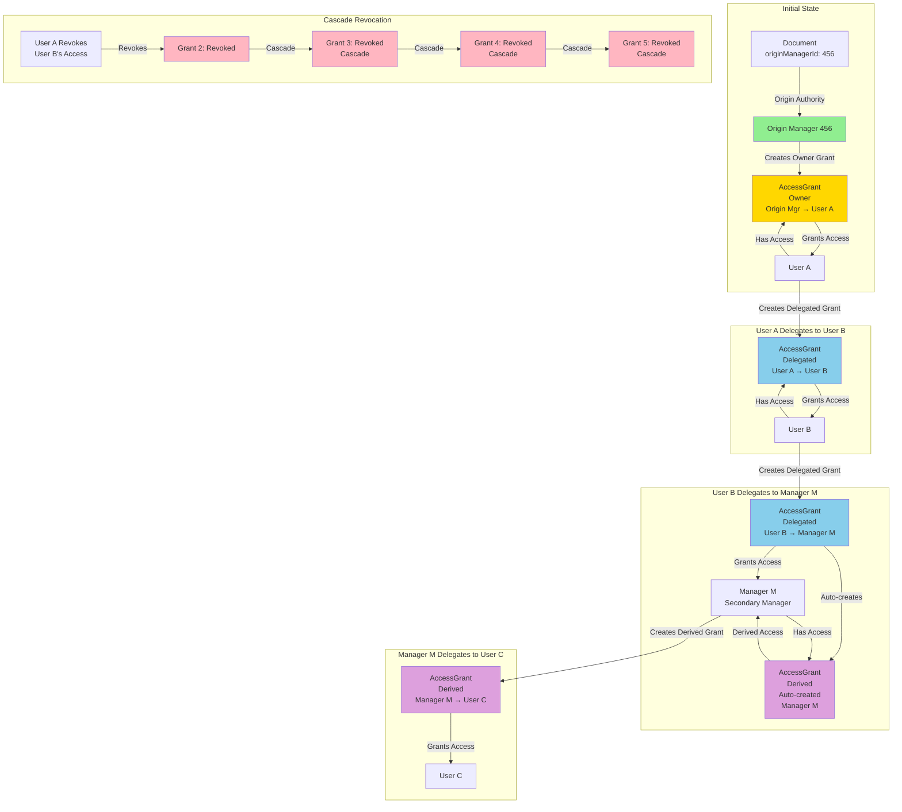

# System Architecture and Use Case Flow Diagrams

**Document Version**: 1.0  
**Generated**: December 2025  
**Classification**: Internal - System Architecture Diagrams

---

## System Architecture Overview

This diagram illustrates the high-level architecture of the Document Identity Management Platform, showing how the major components interact and the flow of data between them.




**Key Components**:

- **Client Layer**: Mobile application authenticates via OAuth and makes API requests
- **Authentication Layer**: Verifies OAuth tokens and issues JWT access tokens
- **API Layer**: Controllers handle HTTP requests, guards enforce authorization
- **Domain Layer**: Business logic services handle document operations, access control, and audit logging
- **Data Layer**: Repositories abstract database operations
- **Storage Layer**: PostgreSQL stores metadata and grants, GCS stores document files, Cloud Logging stores audit events

---

## Document Upload and Processing Flow

This diagram shows the complete flow when a user uploads a document, including origin manager assignment, access grant creation, and OCR processing.




**Flow Summary**:

1. User uploads document with explicit origin manager selection
2. System validates manager is verified
3. Document is created with immutable origin manager assignment
4. File is uploaded to Google Cloud Storage
5. Default access grant is created for uploading user
6. Audit events are logged for all actions
7. Origin manager can later trigger OCR processing
8. OCR results are stored and document status updated

---

## Document Access Flow

This diagram illustrates how document access is resolved when different actors attempt to view a document.


```mermaid
sequenceDiagram
    participant Actor as Actor (User/Manager/Admin)
    participant API as API Controller
    participant Guard as Authorization Guard
    participant DocService as Document Service
    participant AccessService as AccessGrant Service
    participant DB as PostgreSQL
    participant Audit as Audit Service

    Actor->>API: GET /v1/documents/{id}<br/>(Bearer Token)
    API->>Guard: Validate JWT & Extract Actor
    Guard->>Guard: Check Role
    
    alt Actor Role = Admin
        Guard-->>API: 403 Forbidden<br/>(Hard Deny)
        API-->>Actor: Admin has no document access
    else Actor Role = Manager or User
        Guard-->>API: Authorized (Actor Type, ID)
        API->>DocService: getDocument(documentId, actorType, actorId)
        
        DocService->>DB: Find Document by ID
        DB-->>DocService: Document Entity
        
        alt Actor is Origin Manager
            DocService->>DB: Check originManagerId == actorId
            DB-->>DocService: Match (Implicit Access)
            DocService->>Audit: Log DOCUMENT_VIEWED<br/>(Implicit Access)
        else Actor is NOT Origin Manager
            DocService->>AccessService: hasAccess(documentId, actorType, actorId)
            AccessService->>DB: Query AccessGrants<br/>(documentId, actorType, actorId, active)
            
            alt Active Grant Exists
                DB-->>AccessService: AccessGrant Found
                AccessService-->>DocService: Access Granted (Explicit)
                DocService->>Audit: Log DOCUMENT_VIEWED<br/>(Explicit Grant)
            else No Active Grant
                DB-->>AccessService: No Grant Found
                AccessService-->>DocService: Access Denied
                DocService->>Audit: Log UNAUTHORIZED_ACCESS_ATTEMPT
                DocService-->>API: 404 Not Found
                API-->>Actor: Document not found
            end
        end
        
        Audit->>DB: Store Audit Event
        DocService-->>API: Document Entity
        API-->>Actor: 200 OK (Document Metadata)
    end
```

**Access Resolution Logic**:

1. **Admin Exclusion**: Admins are hard-denied at guard level (no document access)
2. **Origin Manager Check**: If actor is manager, check if they are origin manager (implicit access)
3. **AccessGrant Resolution**: If not origin manager, query for active access grants
4. **Audit Logging**: All access attempts (successful or not) are logged
5. **Security**: No access returns 404 (not 403) to prevent information leakage

---

## Access Grant Creation and Cascade Flow

This diagram shows how access grants are created and how cascade revocation works when grants are revoked.




**Legend**:

- **Green**: Origin Manager (custodial authority)
- **Gold**: Owner Grant (full access, created by origin manager)
- **Light Blue**: Delegated Grant (created by users with access)
- **Purple**: Derived Grant (auto-created when manager receives delegated grant)
- **Pink**: Revoked Grants (cascade effect)

**Key Concepts**:

- **Owner Grants**: Only origin manager can create these (full access)
- **Delegated Grants**: Users can share access they received
- **Derived Grants**: Automatically created when managers receive delegated grants
- **Cascade Revocation**: Revoking a delegated grant automatically revokes all derived grants

---

## Complete Use Case: User Upload with Manager Review

This diagram shows a complete end-to-end use case where a user uploads a document, the origin manager reviews it, triggers OCR, and grants access to another user.


```mermaid
flowchart TD
    Start([User Wants to Upload Document]) --> Select[User Selects Origin Manager<br/>from Verified Directory]
    Select --> Upload[POST /v1/documents/upload<br/>File + originManagerId]
    Upload --> Validate{Manager<br/>Verified?}
    Validate -->|No| Error1[403 Forbidden<br/>Manager Not Verified]
    Validate -->|Yes| Create[Create Document<br/>originManagerId = Manager ID<br/>originUserContextId = User ID]
    
    Create --> Store[Upload to GCS<br/>Status: STORED]
    Store --> Grant1[Create Default<br/>AccessGrant for User]
    Grant1 --> Log1[Log Audit Events:<br/>DOCUMENT_INTAKE_BY_USER<br/>ORIGIN_MANAGER_ASSIGNED<br/>ACCESS_GRANTED]
    Log1 --> Notify1[Notify Origin Manager<br/>Document Received]
    Notify1 --> Complete1([Document Uploaded])
    
    Complete1 --> ManagerView[Manager Reviews Document]
    ManagerView --> Trigger[Manager Triggers OCR<br/>POST /v1/documents/{id}/ocr/trigger]
    Trigger --> CheckAuth{Is Origin<br/>Manager?}
    CheckAuth -->|No| Error2[403 Forbidden<br/>Not Origin Manager]
    CheckAuth -->|Yes| Process[Status: PROCESSING<br/>Send to Document AI]
    
    Process --> OCR[Document AI<br/>Extracts Text & Fields]
    OCR --> Complete2[Status: PROCESSED<br/>Store OCR Results]
    Complete2 --> Log2[Log Audit Event:<br/>DOCUMENT_PROCESSING_COMPLETED]
    
    Log2 --> ManagerShare[Manager Grants Access<br/>to Another User]
    ManagerShare --> CreateGrant[POST /v1/documents/{id}/access-grants<br/>Create Owner Grant]
    CreateGrant --> Grant2[AccessGrant Created<br/>User Can Now View Document]
    Grant2 --> Log3[Log Audit Event:<br/>ACCESS_GRANTED]
    Log3 --> Notify2[Notify User<br/>Access Granted]
    Notify2 --> End([Use Case Complete])
    
    Error1 --> End
    Error2 --> End
    
    style Start fill:#E6F3FF
    style Complete1 fill:#90EE90
    style Complete2 fill:#90EE90
    style End fill:#90EE90
    style Error1 fill:#FFB6C1
    style Error2 fill:#FFB6C1
```

**Use Case Steps**:

1. User selects verified origin manager from directory
2. Document is uploaded and assigned to manager (immutable)
3. Default access grant is created for uploading user
4. Origin manager is notified of new document
5. Manager reviews and triggers OCR processing
6. OCR extracts structured fields from document
7. Manager can grant access to other users
8. All actions are audited for HIPAA compliance

---

**Document Status**: Complete  
**Note**: These diagrams provide visual representations of the system architecture and key workflows. Refer to the main architecture report for detailed textual descriptions.
